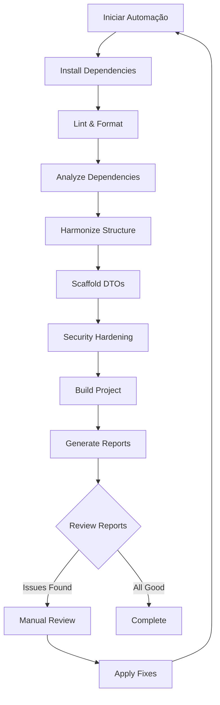

# Elevare Auto-Agent Full Run - Documentação

## 📋 Visão Geral

Este repositório contém scripts de automação completa para o backend Elevare, permitindo que agentes do GitHub executem automaticamente ~70-75% das tarefas necessárias para completar o backend.

## 🚀 Scripts Principais

### 1. `elevare-auto-agent-full-run.sh`

**Script principal** que executa toda a pipeline de automação.

```bash
bash elevare-auto-agent-full-run.sh
```

**O que faz:**
- ✅ Instala dependências (npm ci/install)
- ✅ Executa ESLint com correções automáticas
- ✅ Aplica Prettier para formatação
- ✅ Analisa e deduplica dependências
- ✅ Harmoniza rotas, serviços e logs
- ✅ Scaffolding de DTOs e validações
- ✅ Aplica security hardening básico
- ✅ Compila projeto (build production)
- ✅ Gera relatórios de integridade

### 2. `elevare_auto_fix.sh`

Script para análise e correção de dependências.

```bash
# Análise simples
bash elevare_auto_fix.sh

# Com análise de dependências não utilizadas
bash elevare_auto_fix.sh --auto-remove-unused
```

**O que faz:**
- Executa depcheck para identificar dependências não utilizadas
- Executa npm dedupe para deduplicação
- Gera relatório em `.elevare_validation_report/depcheck.json`

### 3. `vsc_adiante.sh`

Script para harmonização de rotas, serviços e logs.

```bash
bash vsc_adiante.sh
```

**O que faz:**
- Verifica estrutura de módulos NestJS
- Identifica arquivos usando console.log vs logger estruturado
- Valida padrões de nomenclatura (kebab-case)
- Gera estatísticas do projeto
- Cria relatório de harmonização

### 4. `auto_fix_and_pr.sh`

Script para scaffolding de DTOs e security hardening.

```bash
# Scaffold de DTOs
bash auto_fix_and_pr.sh --scaffold-dtos

# Security hardening
bash auto_fix_and_pr.sh --security-basic

# Ambos
bash auto_fix_and_pr.sh --scaffold-dtos --security-basic
```

**O que faz:**
- **--scaffold-dtos**: Verifica DTOs, validações class-validator, gera relatório
- **--security-basic**: Verifica helmet, throttler, bcrypt, gera relatório de segurança

## 📁 Estrutura de Relatórios

Todos os relatórios são salvos em `.elevare_validation_report/`:

```
.elevare_validation_report/
├── FINAL_SUMMARY.md              # Resumo final da automação
├── eslint.json                   # Relatório completo ESLint
├── eslint-fix.log                # Log de correções ESLint
├── prettier.log                  # Log de formatação Prettier
├── depcheck.json                 # Análise de dependências
├── dedupe.log                    # Log de deduplicação
├── harmonization-report.txt      # Status de harmonização
├── dto-validation-report.txt     # Análise de DTOs
├── security-report.txt           # Status de segurança
├── build.log                     # Log de build
├── npm-install.log               # Log de instalação
└── ...                           # Outros logs e relatórios
```

## 🔧 Configuração

### Ferramentas Instaladas

O projeto agora inclui:

- **ESLint** - Linting de código TypeScript/JavaScript
- **Prettier** - Formatação de código
- **depcheck** - Análise de dependências
- **class-validator** - Validação de DTOs
- **class-transformer** - Transformação de DTOs
- **helmet** - Segurança HTTP headers
- **@nestjs/throttler** - Rate limiting
- **bcrypt** - Hashing de senhas

### Arquivos de Configuração

- `.eslintrc.js` ou `eslint.config.js` - Configuração ESLint
- `.prettierrc` - Configuração Prettier
- `.prettierignore` - Arquivos ignorados pelo Prettier
- `.gitignore` - Atualizado para ignorar relatórios e builds

## 📊 Exemplo de Execução

```bash
# Clone o repositório
git clone https://github.com/Carine01/meu-backend.git
cd meu-backend

# Execute a automação completa
bash elevare-auto-agent-full-run.sh

# Revise os relatórios
cat .elevare_validation_report/FINAL_SUMMARY.md
```

## ✅ O Que é Automatizado (70-75%)

### ✅ Completamente Automatizado

1. **Análise Estática**
   - Linting com ESLint
   - Formatação com Prettier
   - Análise de dependências

2. **Estrutura do Código**
   - Harmonização de rotas e serviços
   - Verificação de padrões NestJS
   - Análise de nomenclatura

3. **Segurança Básica**
   - Verificação de dependências de segurança
   - Validação de implementações básicas
   - Relatórios de hardening

4. **Build e Compilação**
   - TypeScript compilation
   - Geração de relatórios de build

### ⚠️ Pendências Manuais (25-30%)

Os agentes **NÃO PODEM** automatizar:

1. **Validação Final de DTOs**
   - Revisão manual de regras de negócio
   - Testes específicos de validação
   - Casos edge específicos do domínio

2. **Testes Reais**
   - Criação de testes unitários específicos
   - Testes E2E com casos reais
   - Testes de integração completos
   - Configuração de mocks e fixtures

3. **Integrações Externas**
   - Configuração Firebase (credenciais)
   - Configuração Stripe (API keys)
   - Testes de webhooks
   - Validação de integrações reais

4. **Documentação e Deploy**
   - Revisão e atualização de README
   - Documentação detalhada de APIs
   - Configuração de CI/CD
   - Deploy e validação em produção

## 🎯 Workflow Típico



## 📈 Métricas e Relatórios

Após a execução, você terá acesso a:

- **Estatísticas do Projeto**: Número de arquivos, módulos, services, controllers, DTOs
- **Cobertura de Validação**: % de DTOs com validações
- **Status de Segurança**: Implementação de helmet, throttler, bcrypt
- **Qualidade de Código**: Warnings e errors do ESLint
- **Dependências**: Análise de pacotes não utilizados e duplicados

## 🛡️ Segurança

Os scripts foram projetados para:

- ✅ Não remover dependências automaticamente (apenas relatar)
- ✅ Criar backups através de logs
- ✅ Executar em modo fail-safe (continua mesmo com erros)
- ✅ Gerar relatórios para revisão manual

## 🤝 Contribuindo

Para adicionar novos scripts de automação:

1. Crie o script em bash seguindo o padrão existente
2. Adicione funções de log (`log_info`, `log_success`, `log_warning`, `log_error`)
3. Gere relatórios em `.elevare_validation_report/`
4. Documente no README
5. Integre ao `elevare-auto-agent-full-run.sh` se apropriado

## 📞 Suporte

Para problemas ou dúvidas:

1. Revise os logs em `.elevare_validation_report/`
2. Verifique o `FINAL_SUMMARY.md` para status geral
3. Abra uma issue no GitHub com logs relevantes

## 📝 Licença

Este projeto está sob a mesma licença do repositório principal.

---

**Última Atualização**: 2025-11-24  
**Versão**: 1.0.0  
**Status**: ✅ Produção
