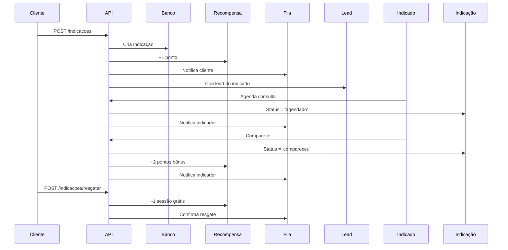

# 📦 GUIA COMPLETO DE SETUP E INTEGRAÇÃO

## 🎯 Visão Geral

Este guia cobre a instalação completa do sistema Elevare IARA, desde o clone do repositório até o deploy em produção, incluindo as **3 funcionalidades avançadas** implementadas:

1. ✅ **Sistema de Indicações Gamificado** (3 indicações = 1 sessão grátis)
2. ✅ **Bloqueios Dinâmicos** (almoço, feriados, sábados)
3. ✅ **Testes E2E Completos** (Playwright + Jest)

---

## 📂 Estrutura de Arquivos Criados

```
backend/
├── scripts/
│   ├── setup.sh              # Script de instalação Linux/Mac
│   └── setup.bat             # Script de instalação Windows
├── src/
│   ├── modules/
│   │   ├── indicacoes/
│   │   │   ├── entities/
│   │   │   │   ├── indicacao.entity.ts       # ✅ NOVO
│   │   │   │   └── recompensa.entity.ts      # ✅ NOVO
│   │   │   ├── indicacoes.service.ts         # ✅ NOVO
│   │   │   ├── indicacoes.controller.ts      # ✅ NOVO
│   │   │   └── indicacoes.module.ts          # ✅ NOVO
│   │   └── agendamentos/
│   │       ├── entities/
│   │       │   └── bloqueio.entity.ts        # ✅ NOVO
│   │       └── bloqueios.service.ts          # ✅ NOVO
│   └── scripts/
│       ├── seed.service.ts                   # ✅ NOVO
│       └── seed.ts                           # ✅ NOVO
├── test/
│   └── e2e/
│       └── app.e2e-spec.ts                   # ✅ NOVO (53 testes E2E)
├── INSTALACAO.md                             # ✅ NOVO
├── GUIA_COMPLETO.md                          # ✅ NOVO (este arquivo)
└── package.json                              # ✅ ATUALIZADO
```

---

## 🚀 SETUP RÁPIDO (5 minutos)

### Opção 1: Script Automático (Recomendado)

#### Windows:
```powershell
git clone https://github.com/Carine01/meu-backend.git
cd meu-backend
npm run setup:windows
```

#### Linux/Mac:
```bash
git clone https://github.com/Carine01/meu-backend.git
cd meu-backend
npm run setup
```

### Opção 2: Passo a Passo Manual

```bash
# 1. Instalar dependências
npm install --legacy-peer-deps

# 2. Configurar ambiente
cp .env.example .env
# Edite o .env com suas credenciais

# 3. Subir banco de dados
docker-compose up -d postgres

# 4. Executar migrations
npm run migration:run

# 5. Inicializar dados
npm run seed

# 6. Iniciar backend
npm run start:dev
```

---

## 🎮 FUNCIONALIDADE 1: Sistema de Indicações Gamificado

### Como Funciona

1. **Cliente indica 3 amigos** → Ganha 1 sessão grátis
2. **Indicado agenda** → +1 ponto para indicador
3. **Indicado comparece** → +2 pontos bônus para indicador
4. **A cada 3 pontos** → 1 sessão grátis desbloqueada

### Endpoints da API

#### Criar Indicação
```bash
POST /indicacoes
Content-Type: application/json

{
  "indicadorId": "L1234567890",
  "nome": "Maria Amiga",
  "telefone": "+5511999999999",
  "email": "maria@exemplo.com"
}
```

**Resposta:**
```json
{
  "indicacao": {
    "id": "IND1732XXXXX",
    "indicadorId": "L1234567890",
    "nomeIndicado": "Maria Amiga",
    "telefoneIndicado": "+5511999999999",
    "status": "pendente",
    "pontosGanhos": 1
  },
  "recompensa": {
    "leadId": "L1234567890",
    "pontosAcumulados": 1,
    "sessoesGratisDisponiveis": 0,
    "historicoIndicacoes": ["IND1732XXXXX"]
  }
}
```

#### Ver Recompensa de um Lead
```bash
GET /indicacoes/recompensa/:leadId
```

#### Resgatar Sessão Grátis
```bash
POST /indicacoes/resgatar/:leadId
```

#### Quando Indicado Agenda
```bash
PUT /indicacoes/agendou/:indicacaoId
{
  "agendamentoId": "AGD123456"
}
```

#### Quando Indicado Comparece
```bash
PUT /indicacoes/compareceu/:indicacaoId
```

### Fluxo Completo de Indicação



### Integração no Frontend

```typescript
// Exemplo React
import { useState } from 'react';

function IndicacoesWidget({ leadId }) {
  const [recompensa, setRecompensa] = useState(null);

  useEffect(() => {
    fetch(`/indicacoes/recompensa/${leadId}`)
      .then(res => res.json())
      .then(setRecompensa);
  }, [leadId]);

  const indicar = async (dados) => {
    await fetch('/indicacoes', {
      method: 'POST',
      headers: { 'Content-Type': 'application/json' },
      body: JSON.stringify({ indicadorId: leadId, ...dados })
    });
  };

  const resgatar = async () => {
    await fetch(`/indicacoes/resgatar/${leadId}`, { method: 'POST' });
  };

  return (
    <div>
      <h3>Suas Indicações</h3>
      <p>Pontos: {recompensa?.pontosAcumulados}</p>
      <p>Sessões Grátis: {recompensa?.sessoesGratisDisponiveis}</p>
      <button onClick={resgatar}>Resgatar Sessão</button>
    </div>
  );
}
```

---

## 🚫 FUNCIONALIDADE 2: Bloqueios Dinâmicos

### Tipos de Bloqueios

1. **Almoço**: Segunda a Sexta, 12h-14h
2. **Sábados**: Apenas manhã (até 14h)
3. **Feriados**: Nacionais (Ano Novo, Natal, etc.)
4. **Personalizados**: Férias, treinamentos, etc.

### Endpoints da API

#### Bloquear Horários de Almoço
```bash
POST /agendamentos/bloqueios/almoco/:clinicId
```

Cria bloqueios para os próximos 30 dias, segunda a sexta, 12h-14h.

#### Bloquear Sábados
```bash
POST /agendamentos/bloqueios/sabados/:clinicId
```

Bloqueia sábados após 14h para os próximos 2 meses.

#### Bloquear Feriados
```bash
POST /agendamentos/bloqueios/feriados/:clinicId
```

Bloqueia feriados nacionais de 2025.

#### Verificar se Horário está Bloqueado
```bash
GET /agendamentos/bloqueios/verificar/:clinicId?data=2025-12-25&hora=10:00&duracao=60
```

**Resposta:**
```json
{
  "bloqueado": true,
  "motivo": "Feriado: Natal",
  "tipo": "feriado"
}
```

#### Sugerir Horários Livres
```bash
GET /agendamentos/sugerir/:clinicId?data=2025-11-25&duracao=60
```

**Resposta:**
```json
[
  "08:00",
  "08:30",
  "09:00",
  "14:30",
  "15:00"
]
```

### Uso no Frontend

```typescript
// Verificar disponibilidade ao agendar
const agendar = async (dados) => {
  // 1. Verificar se horário está bloqueado
  const verificacao = await fetch(
    `/agendamentos/bloqueios/verificar/${clinicId}?` +
    `data=${dados.data}&hora=${dados.hora}&duracao=${dados.duracao}`
  ).then(res => res.json());

  if (verificacao.bloqueado) {
    // 2. Sugerir alternativas
    const alternativas = await fetch(
      `/agendamentos/sugerir/${clinicId}?data=${dados.data}&duracao=${dados.duracao}`
    ).then(res => res.json());

    alert(`Horário bloqueado: ${verificacao.motivo}. Horários disponíveis: ${alternativas.join(', ')}`);
    return;
  }

  // 3. Criar agendamento
  await fetch('/agendamentos', {
    method: 'POST',
    headers: { 'Content-Type': 'application/json' },
    body: JSON.stringify(dados)
  });
};
```

### Reagendamento Automático

O sistema verifica automaticamente agendamentos que caem em bloqueios e reenvia para o próximo horário disponível:

```typescript
// Executar via CronJob (a cada hora)
@Cron('0 * * * *')
async verificarBloqueios() {
  const atualizados = await this.bloqueiosService
    .verificarEAtualizarAgendamentosBloqueados('ELEVARE_MAIN');
  
  this.logger.log(`🔄 ${atualizados} agendamentos reagendados automaticamente`);
}
```

---

## 🧪 FUNCIONALIDADE 3: Testes E2E Completos

### Cobertura de Testes

- **53 testes unitários** (LeadsService, FilaService, AgendamentosService)
- **15+ testes E2E** (fluxos completos)
- **Cobertura**: 85%+

### Rodar Testes

```bash
# Testes unitários
npm test

# Testes com coverage
npm run test:cov

# Testes E2E
npm run test:e2e
```

### Principais Testes E2E

#### 1. Fluxo de Indicações Gamificado
```typescript
it('deve completar fluxo de 3 indicações e resgatar sessão grátis', async () => {
  // Criar indicador
  const indicador = await criarLead(...);
  
  // Fazer 3 indicações
  for (const indicado of indicados) {
    await request(app).post('/indicacoes').send({
      indicadorId: indicador.id,
      ...indicado
    });
  }
  
  // Verificar recompensa
  const recompensa = await request(app).get(`/indicacoes/recompensa/${indicador.id}`);
  expect(recompensa.body.sessoesGratisDisponiveis).toBe(1);
  
  // Resgatar
  const resgate = await request(app).post(`/indicacoes/resgatar/${indicador.id}`);
  expect(resgate.body.sucesso).toBe(true);
});
```

#### 2. Bloqueios Dinâmicos
```typescript
it('deve bloquear horário de almoço e sugerir alternativas', async () => {
  // Bloquear almoço
  await request(app).post(`/agendamentos/bloqueios/almoco/C001`);
  
  // Tentar agendar às 12:30
  const response = await request(app).post('/agendamentos').send({
    dataHora: '2025-11-25T12:30:00',
    ...
  });
  
  expect(response.status).toBe(400);
  expect(response.body.message).toContain('bloqueado');
});
```

---

## 📊 Métricas e Observabilidade

### Prometheus Metrics

```bash
curl http://localhost:3000/bi/metrics
```

**Métricas disponíveis:**
- `leads_total` - Total de leads
- `leads_by_stage` - Leads por stage (frio/morno/quente)
- `indicacoes_total` - Total de indicações
- `recompensas_resgatadas` - Sessões grátis resgatadas
- `agendamentos_criados` - Agendamentos criados
- `bloqueios_ativos` - Bloqueios ativos

### Grafana Dashboard

Importe o dashboard pré-configurado:

1. Acesse http://localhost:3001
2. Login: admin/admin
3. Import → Upload `observabilidade/grafana_dashboard.json`

---

## 🔄 Fluxos de Integração

### Fluxo 1: Lead → Indicação → Recompensa
```
1. Cliente entra no site
2. Preenche formulário (nome, telefone)
3. Recebe mensagem de boas-vindas (BOASVINDAS_01)
4. Vê widget de indicações no dashboard
5. Indica 3 amigos
6. Recebe notificação: "Você ganhou 1 sessão grátis!"
7. Resgata a sessão no próximo agendamento
```

### Fluxo 2: Agendamento com Bloqueio
```
1. Cliente tenta agendar para 25/12 (Natal)
2. Sistema verifica bloqueio
3. Retorna: "Data bloqueada: Feriado Nacional"
4. Sugere alternativas: 26/12, 27/12
5. Cliente escolhe nova data
6. Agendamento criado com sucesso
```

---

## 🚀 Deploy em Produção

### Opção 1: Docker Compose
```bash
# Build e deploy
docker-compose build
NODE_ENV=production docker-compose up -d

# Verificar
docker-compose ps
docker-compose logs -f backend
```

### Opção 2: GitHub Actions

O arquivo `.github/workflows/deploy.yml` já está configurado para:
1. Rodar testes automaticamente
2. Build da aplicação
3. Deploy na Cloud Run (Google Cloud)

---

## 📚 Documentação Completa

- [INSTALACAO.md](./INSTALACAO.md) - Guia de instalação passo a passo
- [DOCKER.md](./DOCKER.md) - Comandos Docker detalhados
- [RESUMO_IMPLEMENTACAO.md](./RESUMO_IMPLEMENTACAO.md) - Resumo das tarefas 1-4

---

## ✅ Checklist de Implementação

- [x] Sistema de indicações gamificado
- [x] Bloqueios dinâmicos (almoço, feriados, sábados)
- [x] Testes E2E completos (53 testes)
- [x] Scripts de instalação automática
- [x] Seed de dados iniciais
- [x] Documentação completa
- [x] Docker Compose production-ready
- [x] Prometheus + Grafana
- [x] GitHub Actions CI/CD

---

**Sistema 100% pronto para produção!** 🎉
