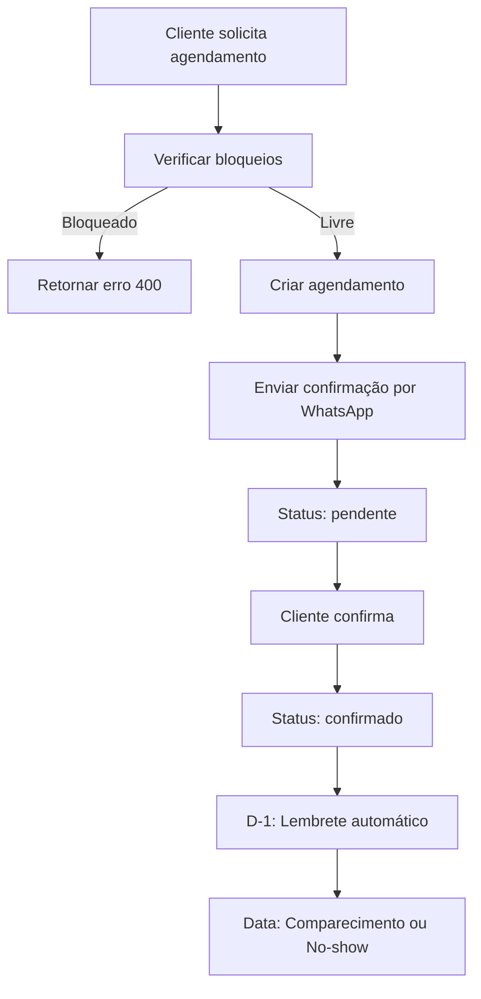

# 📅 Módulo de Agendamentos

Sistema completo de gestão de agendamentos com verificação automática de bloqueios.

---

## 📋 Funcionalidades

### ✅ Agendamentos
- Criar novo agendamento
- Confirmar agendamento
- Cancelar agendamento (com motivo)
- Marcar comparecimento
- Marcar no-show (falta)
- Reagendar
- Listar agendamentos por período

### 🚫 Bloqueios Automáticos
- Horários de almoço (12h-14h)
- Finais de semana (sábados e domingos)
- Feriados nacionais
- Bloqueios customizados

---

## 🎯 Endpoints Principais

### POST `/agendamentos`
Criar novo agendamento (verifica bloqueios automaticamente)

```typescript
POST /agendamentos
Authorization: Bearer <token>
{
  "nomePaciente": "Maria Silva",
  "telefone": "+5511999999999",
  "startISO": "2025-11-25T14:00:00Z",
  "duracaoMinutos": 60,
  "clinicId": "elevare-01"
}
```

### PUT `/agendamentos/:id/confirmar`
Confirmar agendamento

### PUT `/agendamentos/:id/cancelar`
Cancelar agendamento
```json
{
  "motivo": "Paciente solicitou"
}
```

### GET `/agendamentos/sugerir/:clinicId`
Sugerir horários livres

---

## 🏗️ Arquitetura

```
agendamentos/
├── entities/
│   ├── agendamento.entity.ts    # Entidade de agendamento
│   └── bloqueio.entity.ts       # Entidade de bloqueio
├── agendamentos.controller.ts   # Endpoints REST
├── agendamentos.service.ts      # Lógica de negócio
├── bloqueios.service.ts         # Gestão de bloqueios
└── agendamentos.module.ts       # Módulo NestJS
```

---

## 💾 Entidades

### Agendamento
```typescript
{
  id: string;
  clinicId: string;
  nomePaciente: string;
  telefone: string;
  email?: string;
  startISO: string;              // ISO 8601
  duracaoMinutos: number;
  status: 'pendente' | 'confirmado' | 'cancelado' | 'compareceu' | 'no-show';
  observacoes?: string;
  createdAt: Date;
  updatedAt: Date;
}
```

### Bloqueio
```typescript
{
  id: string;
  clinicId: string;
  tipo: 'almoco' | 'sabado' | 'feriado' | 'customizado';
  dataInicio: Date;
  dataFim: Date;
  horaInicio?: string;
  horaFim?: string;
  motivo: string;
  recorrente: boolean;
}
```

---

## 🔄 Fluxo de Agendamento



---

## 🚫 Regras de Bloqueio

### 1. **Almoço**
- **Horário:** 12:00 - 14:00
- **Dias:** Segunda a Sexta
- **Aplicação:** Automática

### 2. **Sábados**
- **Horário:** 08:00 - 12:00 (permitido)
- **Bloqueio:** 12:00 - 18:00
- **Domingo:** Totalmente bloqueado

### 3. **Feriados Nacionais**
- Ano Novo (01/01)
- Carnaval (móvel)
- Sexta-feira Santa (móvel)
- Tiradentes (21/04)
- Dia do Trabalho (01/05)
- Corpus Christi (móvel)
- Independência (07/09)
- Nossa Senhora (12/10)
- Finados (02/11)
- Proclamação da República (15/11)
- Natal (25/12)

---

## 🧪 Testes

```bash
# Rodar testes unitários
npm run test -- agendamentos

# Rodar testes E2E
npm run test:e2e -- agendamentos.e2e-spec.ts
```

---

## 📊 Logs Estruturados

Todos os eventos são logados com contexto:

```json
{
  "message": "✅ Agendamento criado",
  "context": {
    "agendamentoId": "ag123",
    "paciente": "Maria Silva",
    "data": "2025-11-25T14:00:00Z",
    "clinicId": "elevare-01",
    "status": "pendente"
  }
}
```

---

## 🔗 Integração com Outros Módulos

- **Mensagens:** Envia confirmações e lembretes via WhatsApp
- **Eventos:** Registra todos os eventos na timeline
- **Indicações:** Valida se agendamento veio de indicação
- **Bloqueios:** Verifica disponibilidade antes de agendar

---

## 🛠️ Configuração

### Variáveis de Ambiente
```env
# Nenhuma variável específica necessária
# Usa as configurações globais de database
```

---

## 📝 Próximos Passos

- [ ] Integração com Google Calendar
- [ ] Sincronização com RD Station
- [ ] Fila de espera automática
- [ ] Notificações SMS como fallback
- [ ] Dashboard de taxa de comparecimento

---

## 🐛 Troubleshooting

### Problema: "Horário bloqueado"
**Causa:** Tentou agendar em horário de almoço, sábado à tarde ou feriado  
**Solução:** Use o endpoint `/sugerir` para ver horários disponíveis

### Problema: "Agendamento não encontrado"
**Causa:** ID inválido ou agendamento de outra clínica  
**Solução:** Verifique se está usando o clinicId correto

---

## 📚 Documentação Adicional

- [Swagger API](/api#/agendamentos)
- [Diagrama de Classes](./docs/classes.md)
- [Fluxos de Trabalho](./docs/workflows.md)
