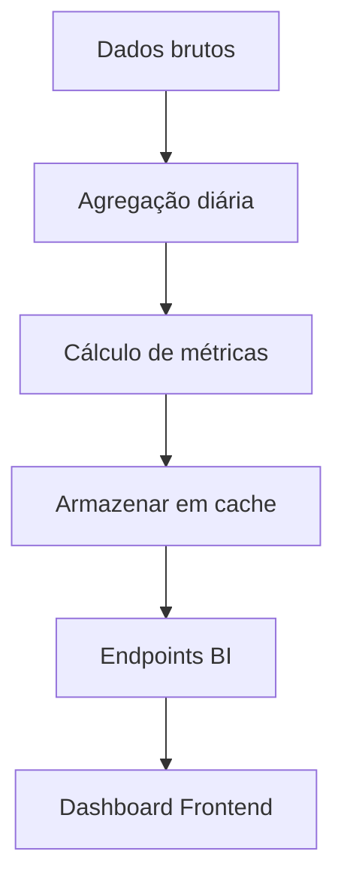

# 📊 Módulo de Business Intelligence (BI)

Sistema de análise de dados e relatórios gerenciais.

---

## 📋 Funcionalidades

### ✅ Relatórios
- Dashboard executivo
- Relatórios de conversão
- Análise de campanhas
- Funil de vendas
- Métricas de atendimento
- ROI por origem de lead

### 📊 Métricas
- Taxa de conversão
- Custo de aquisição (CAC)
- Lifetime Value (LTV)
- Taxa de retenção
- No-show rate
- Tempo médio de conversão

---

## 🎯 Endpoints Principais

### GET `/bi/dashboard`
Dashboard executivo com KPIs principais

```typescript
GET /bi/dashboard?periodo=30d
Authorization: Bearer <token>

Response:
{
  "periodo": "últimos 30 dias",
  "leads": {
    "total": 500,
    "novos": 120,
    "ativos": 250,
    "convertidos": 100,
    "taxaConversao": 20.0
  },
  "agendamentos": {
    "total": 180,
    "confirmados": 150,
    "comparecimentos": 130,
    "noShows": 20,
    "taxaComparecimento": 86.7
  },
  "receita": {
    "total": 15000.00,
    "ticketMedio": 150.00,
    "crescimento": "+12.5%"
  },
  "indicacoes": {
    "total": 25,
    "convertidas": 15,
    "taxaConversao": 60.0
  }
}
```

### GET `/bi/funil`
Funil de vendas detalhado

```typescript
GET /bi/funil?periodo=30d
Authorization: Bearer <token>

Response:
{
  "etapas": [
    {
      "nome": "Leads Criados",
      "quantidade": 500,
      "percentual": 100.0
    },
    {
      "nome": "Primeira Resposta",
      "quantidade": 350,
      "percentual": 70.0,
      "queda": -30.0
    },
    {
      "nome": "Agendamento Criado",
      "quantidade": 180,
      "percentual": 36.0,
      "queda": -48.6
    },
    {
      "nome": "Sessão Confirmada",
      "quantidade": 150,
      "percentual": 30.0,
      "queda": -16.7
    },
    {
      "nome": "Compareceu",
      "quantidade": 130,
      "percentual": 26.0,
      "queda": -13.3
    },
    {
      "nome": "Cliente Ativo",
      "quantidade": 100,
      "percentual": 20.0,
      "queda": -23.1
    }
  ]
}
```

### GET `/bi/conversao-por-origem`
Análise por origem de lead

```typescript
GET /bi/conversao-por-origem?periodo=90d
Authorization: Bearer <token>

Response:
[
  {
    "origem": "google",
    "leads": 200,
    "convertidos": 50,
    "taxaConversao": 25.0,
    "investimento": 5000.00,
    "cac": 100.00,
    "roi": 150.0
  },
  {
    "origem": "instagram",
    "leads": 150,
    "convertidos": 30,
    "taxaConversao": 20.0,
    "investimento": 3000.00,
    "cac": 100.00,
    "roi": 120.0
  },
  {
    "origem": "indicacao",
    "leads": 100,
    "convertidos": 60,
    "taxaConversao": 60.0,
    "investimento": 0.00,
    "cac": 0.00,
    "roi": "∞"
  }
]
```

### GET `/bi/tendencias`
Análise de tendências (série temporal)

```typescript
GET /bi/tendencias?metrica=conversao&periodo=6m
Authorization: Bearer <token>

Response:
{
  "metrica": "Taxa de Conversão",
  "dados": [
    { "mes": "2025-06", "valor": 18.5 },
    { "mes": "2025-07", "valor": 19.2 },
    { "mes": "2025-08", "valor": 20.1 },
    { "mes": "2025-09", "valor": 19.8 },
    { "mes": "2025-10", "valor": 21.5 },
    { "mes": "2025-11", "valor": 22.3 }
  ],
  "crescimento": "+20.5%",
  "tendencia": "crescente"
}
```

---

## 🏗️ Arquitetura

```
bi/
├── bi.controller.ts             # Endpoints REST
├── bi.service.ts                # Lógica de agregação
├── queries/
│   ├── dashboard.query.ts       # Query do dashboard
│   ├── funil.query.ts           # Query do funil
│   └── conversao.query.ts       # Query de conversão
└── bi.module.ts                 # Módulo NestJS
```

---

## 📊 Métricas Calculadas

### Taxa de Conversão
```typescript
taxaConversao = (clientesConvertidos / totalLeads) * 100
```

### Custo de Aquisição (CAC)
```typescript
CAC = investimentoTotal / clientesConvertidos
```

### Lifetime Value (LTV)
```typescript
LTV = ticketMedio * frequenciaMedia * tempoRetencao
```

### ROI (Return on Investment)
```typescript
ROI = ((receitaTotal - investimento) / investimento) * 100
```

### Taxa de Comparecimento
```typescript
taxaComparecimento = (comparecimentos / agendamentosConfirmados) * 100
```

### No-Show Rate
```typescript
noShowRate = (faltas / agendamentosConfirmados) * 100
```

---

## 📈 Dashboard Executivo

### KPIs Principais

| KPI | Descrição | Meta |
|-----|-----------|------|
| **Taxa de Conversão** | Leads → Clientes | > 20% |
| **CAC** | Custo por cliente | < R$ 150 |
| **LTV** | Valor total do cliente | > R$ 1.500 |
| **LTV/CAC** | Retorno sobre aquisição | > 10x |
| **Taxa de Comparecimento** | Sessões realizadas | > 85% |
| **No-Show Rate** | Faltas | < 15% |
| **Tempo Médio de Conversão** | Lead → Cliente | < 7 dias |

---

## 🔄 Fluxo de Análise



---

## 📊 Logs Estruturados

```json
{
  "message": "📊 Relatório gerado",
  "context": {
    "tipo": "dashboard",
    "periodo": "30d",
    "tempoExecucao": "245ms",
    "clinicId": "elevare-01"
  }
}
```

---

## 🔗 Integração com Outros Módulos

BI consome dados de:
- **Leads:** Total, status, origem
- **Agendamentos:** Confirmações, comparecimentos, no-shows
- **Indicações:** Conversões, recompensas
- **Eventos:** Timeline completa
- **Mensagens:** Taxa de entrega, leitura

---

## 🛠️ Configuração

### Variáveis de Ambiente
```env
# Cache de Relatórios
BI_CACHE_TTL=3600               # 1 hora
BI_REFRESH_INTERVAL=300         # 5 minutos

# Performance
BI_MAX_PERIODO_DIAS=365         # Máximo 1 ano
BI_PARALLEL_QUERIES=true        # Queries paralelas
```

---

## 🧪 Testes

```bash
# Rodar testes unitários
npm run test -- bi

# Testar queries pesadas
npm run test:e2e -- bi.e2e-spec.ts
```

---

## 🔧 Como Usar

### 1. Dashboard Executivo
```bash
curl http://localhost:3000/api/bi/dashboard?periodo=30d \
  -H "Authorization: Bearer <token>"
```

### 2. Funil de Vendas
```bash
curl http://localhost:3000/api/bi/funil?periodo=90d \
  -H "Authorization: Bearer <token>"
```

### 3. ROI por Origem
```bash
curl http://localhost:3000/api/bi/conversao-por-origem?periodo=6m \
  -H "Authorization: Bearer <token>"
```

### 4. Tendências
```bash
curl "http://localhost:3000/api/bi/tendencias?metrica=conversao&periodo=12m" \
  -H "Authorization: Bearer <token>"
```

---

## 📊 Exemplos de Análises

### Análise de Campanhas
```sql
-- Query exemplo (simplificada)
SELECT 
  origem,
  COUNT(*) as total_leads,
  SUM(CASE WHEN status = 'convertido' THEN 1 ELSE 0 END) as convertidos,
  ROUND(AVG(CASE WHEN status = 'convertido' THEN 1 ELSE 0 END) * 100, 2) as taxa_conversao
FROM leads
WHERE clinicId = 'elevare-01'
  AND createdAt >= NOW() - INTERVAL '30 days'
GROUP BY origem
ORDER BY taxa_conversao DESC;
```

### Análise de Retenção
```sql
SELECT 
  DATE_TRUNC('month', createdAt) as mes,
  COUNT(DISTINCT leadId) as clientes_ativos,
  COUNT(*) as total_sessoes,
  ROUND(AVG(sessoes_por_cliente), 2) as media_sessoes
FROM agendamentos
WHERE status = 'compareceu'
  AND clinicId = 'elevare-01'
GROUP BY mes
ORDER BY mes;
```

---

## 📈 Export de Dados

### CSV Export
```typescript
GET /bi/export?tipo=dashboard&formato=csv
Authorization: Bearer <token>

Response: (arquivo CSV)
```

### Excel Export
```typescript
GET /bi/export?tipo=funil&formato=xlsx
Authorization: Bearer <token>

Response: (arquivo Excel)
```

---

## 🚀 Performance

### Otimizações Implementadas
- ✅ Cache de queries (Redis)
- ✅ Agregações pré-calculadas
- ✅ Índices estratégicos no banco
- ✅ Queries paralelas
- ✅ Paginação de resultados
- ✅ Materialized Views

### Tempo de Resposta Esperado

| Endpoint | Tempo |
|----------|-------|
| Dashboard | < 500ms |
| Funil | < 300ms |
| Conversão por Origem | < 1s |
| Tendências | < 2s |

---

## 📝 Próximos Passos

- [ ] Dashboard em tempo real (WebSocket)
- [ ] Alertas inteligentes (ML)
- [ ] Previsões de receita
- [ ] Comparação com benchmarks
- [ ] Export para Google Data Studio
- [ ] Integração com Power BI
- [ ] Análise de coortes
- [ ] Segmentação RFM

---

## 🐛 Troubleshooting

### Problema: "Query muito lenta"
**Causa:** Período muito amplo ou falta de índices  
**Solução:** Limitar período ou criar índices no banco

### Problema: "Dados inconsistentes"
**Causa:** Cache desatualizado  
**Solução:** Limpar cache Redis ou aguardar refresh (5 min)

### Problema: "Timeout na API"
**Causa:** Muitas queries simultâneas  
**Solução:** Ativar `BI_PARALLEL_QUERIES=true`

---

## 📚 Documentação Adicional

- [Swagger API](/api#/bi)
- [Guia de Métricas](./docs/metricas.md)
- [Query Optimization](./docs/performance.md)
- [Data Warehouse Schema](./docs/schema.md)
