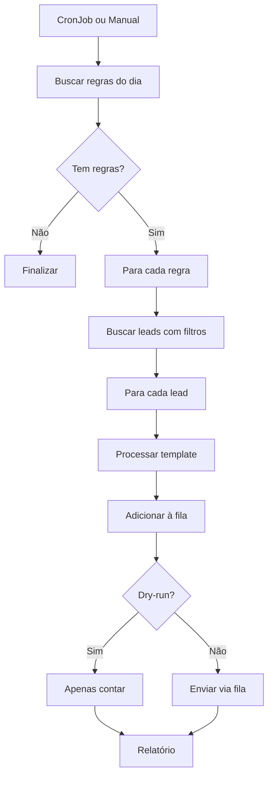

# 🎯 Módulo de Campanhas

Sistema de automação de mensagens baseado em regras e agendamento semanal.

---

## 📋 Funcionalidades

### ✅ Campanhas Automáticas
- Agenda semanal automática (segunda a domingo)
- Regras por dia da semana
- Filtros por status de lead
- Envio em lote via fila
- Controle de horário de envio
- Dry-run (preview sem enviar)

### 📊 Relatórios
- Total de leads processados
- Taxa de envio
- Regras aplicadas
- Histórico de execuções

---

## 🎯 Endpoints Principais

### POST `/campanhas/agenda-semanal/executar`
Executar agenda semanal (manual ou CronJob)

```typescript
POST /campanhas/agenda-semanal/executar
Authorization: Bearer <admin_token>
{
  "dryRun": false,
  "dia": "segunda"  // opcional, default: dia atual
}

Response:
{
  "dia": "segunda",
  "regrasAplicadas": 2,
  "leadsProcessados": 45,
  "mensagensEnviadas": 45
}
```

### GET `/campanhas/regras-semanais`
Visualizar regras configuradas

```typescript
GET /campanhas/regras-semanais
Authorization: Bearer <token>

Response:
{
  "segunda": [
    {
      "nome": "Retorno de Leads Inativos",
      "filtros": { "status": "inativo", "diasSemContato": 30 },
      "templateId": "tpl_retorno"
    }
  ],
  "terca": [...],
  ...
}
```

---

## 🏗️ Arquitetura

```
campanhas/
├── entities/
│   └── agenda-semanal.entity.ts # Configuração semanal
├── agenda-semanal.controller.ts # Endpoints REST
├── agenda-semanal.service.ts    # Lógica de negócio
└── campanhas.module.ts          # Módulo NestJS
```

---

## 💾 Entidade AgendaSemanal

```typescript
{
  id: string;
  clinicId: string;
  diaSemana: 'segunda' | 'terca' | 'quarta' | 'quinta' | 'sexta' | 'sabado' | 'domingo';
  nome: string;                  // Nome da campanha
  filtros: {
    status?: string[];           // ['novo', 'inativo']
    diasSemContato?: number;     // 30 dias
    tags?: string[];             // ['indicacao', 'campanha-x']
  };
  templateId: string;            // Template de mensagem
  horarioEnvio: string;          // "10:00"
  ativo: boolean;
  createdAt: Date;
  updatedAt: Date;
}
```

---

## 📅 Agenda Semanal Padrão

### Segunda-feira
**Retorno de Leads Inativos (30 dias)**
- Filtro: `status = 'inativo' AND diasSemContato >= 30`
- Template: Mensagem de retorno personalizada
- Horário: 10h

### Terça-feira
**Leads Novos Sem Agendamento (7 dias)**
- Filtro: `status = 'novo' AND diasSemAgendamento >= 7`
- Template: Incentivo para agendar primeira sessão
- Horário: 14h

### Quarta-feira
**Leads com Sessão Única (60 dias)**
- Filtro: `totalSessoes = 1 AND diasUltimaSessao >= 60`
- Template: Oferta especial de retorno
- Horário: 11h

### Quinta-feira
**Indicações Não Convertidas (14 dias)**
- Filtro: `origem = 'indicacao' AND status != 'convertido' AND diasCadastro >= 14`
- Template: Lembrete do benefício de indicação
- Horário: 15h

### Sexta-feira
**Aniversariantes da Semana**
- Filtro: `aniversario IN [hoje+1, hoje+7]`
- Template: Mensagem de parabéns + desconto
- Horário: 9h

### Sábado e Domingo
**Sem envios automáticos** (configurável)

---

## 🔄 Fluxo de Execução



---

## ⏰ CronJob Automático

### Configuração

```typescript
@Cron('0 10 * * 1-5') // Segunda a sexta às 10h
async executarAutomaticamente() {
  const diaAtual = this.getDiaSemana(); // 'segunda', 'terca'...
  
  await this.executarAgenda({
    dia: diaAtual,
    dryRun: false
  });
}
```

### Horários Customizados
Cada regra pode ter seu próprio horário:
```typescript
{
  "diaSemana": "segunda",
  "horarioEnvio": "14:30",  // Será executada às 14:30
  ...
}
```

---

## 🎯 Filtros Disponíveis

### Por Status
```typescript
{
  "filtros": {
    "status": ["novo", "inativo"]
  }
}
```

### Por Tempo
```typescript
{
  "filtros": {
    "diasSemContato": 30,       // Sem mensagem há 30 dias
    "diasSemAgendamento": 7,    // Sem agendamento há 7 dias
    "diasUltimaSessao": 60      // Última sessão há 60 dias
  }
}
```

### Por Origem
```typescript
{
  "filtros": {
    "origem": ["indicacao", "google", "instagram"]
  }
}
```

### Por Tags
```typescript
{
  "filtros": {
    "tags": ["vip", "campanha-verao"]
  }
}
```

### Combinações
```typescript
{
  "filtros": {
    "status": ["inativo"],
    "diasSemContato": 30,
    "origem": ["indicacao"],
    "tags": ["vip"]
  }
}
// AND entre todos os filtros
```

---

## 📊 Logs Estruturados

```json
{
  "message": "📅 Executando agenda semanal",
  "context": {
    "dia": "segunda",
    "regrasEncontradas": 2,
    "leadsProcessados": 45,
    "clinicId": "elevare-01"
  }
}
```

---

## 🚨 Avisos Importantes

### ⚠️ Envio em Massa
Executar campanhas pode enviar **centenas de mensagens**. Sempre:
1. Testar com `dryRun: true` primeiro
2. Verificar filtros estão corretos
3. Confirmar templates estão aprovados
4. Respeitar limites da API WhatsApp

### ⚠️ Horários de Envio
- **Evitar:** 22h - 8h (horário de descanso)
- **Ideal:** 9h - 18h (horário comercial)
- **Exceções:** Lembretes urgentes

---

## 🔗 Integração com Outros Módulos

- **Fila:** Envia todas as mensagens via fila (não bloqueia)
- **Mensagens:** Usa templates processados
- **Leads:** Busca leads com filtros
- **Eventos:** Registra execução de campanhas
- **WhatsApp:** Envia mensagens via provider

---

## 🛠️ Configuração

### Criar Nova Regra

```bash
curl -X POST http://localhost:3000/api/campanhas/regras-semanais \
  -H "Authorization: Bearer <token>" \
  -H "Content-Type: application/json" \
  -d '{
    "diaSemana": "segunda",
    "nome": "Retorno de Leads Inativos",
    "filtros": {
      "status": ["inativo"],
      "diasSemContato": 30
    },
    "templateId": "tpl_retorno",
    "horarioEnvio": "10:00",
    "ativo": true
  }'
```

---

## 🧪 Testes

### Dry-Run (Simulação)
```bash
curl -X POST http://localhost:3000/api/campanhas/agenda-semanal/executar \
  -H "Authorization: Bearer <token>" \
  -H "Content-Type: application/json" \
  -d '{
    "dryRun": true,
    "dia": "segunda"
  }'
```

Retorna quantos leads seriam afetados **sem enviar**.

---

## 📈 Exemplo de Relatório

```json
{
  "dia": "segunda",
  "dataExecucao": "2025-11-22T10:00:00Z",
  "regrasAplicadas": 2,
  "detalhes": [
    {
      "regra": "Retorno de Leads Inativos",
      "leadsProcessados": 30,
      "mensagensEnviadas": 30
    },
    {
      "regra": "Leads Novos Sem Agendamento",
      "leadsProcessados": 15,
      "mensagensEnviadas": 15
    }
  ],
  "total": {
    "leadsProcessados": 45,
    "mensagensEnviadas": 45,
    "duracaoSegundos": 12.5
  }
}
```

---

## 📝 Próximos Passos

- [ ] Editor visual de regras
- [ ] A/B testing de templates
- [ ] Analytics de conversão
- [ ] Pausar campanhas automaticamente (baixa taxa de resposta)
- [ ] Segmentação avançada (comportamento, localização)
- [ ] Integração com RD Station (sincronizar status)

---

## 🐛 Troubleshooting

### Problema: "Nenhuma regra encontrada para hoje"
**Causa:** Dia da semana sem regras configuradas  
**Solução:** Criar regra para o dia atual via POST `/campanhas/regras-semanais`

### Problema: "Muitos leads processados (1000+)"
**Causa:** Filtros muito abrangentes  
**Solução:** Refinar filtros, usar `dryRun: true` para testar

### Problema: "Template não aprovado"
**Causa:** Template ainda em aprovação no Meta  
**Solução:** Aguardar aprovação ou usar template já aprovado

---

## 📚 Documentação Adicional

- [Swagger API](/api#/campanhas)
- [Guia de Filtros](./docs/filtros.md)
- [Boas Práticas de Campanhas](./docs/boas-praticas.md)
