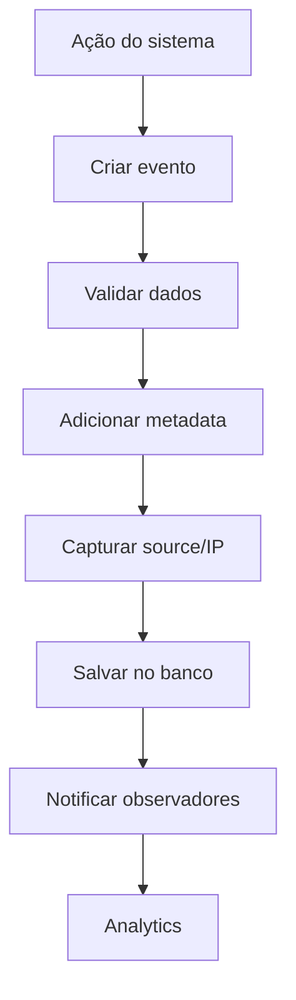

# 📊 Módulo de Eventos

Sistema de auditoria e timeline de eventos para rastreamento de ações.

---

## 📋 Funcionalidades

### ✅ Registro de Eventos
- Auditoria completa de todas as ações
- Timeline cronológica por lead
- Busca por tipo de evento
- Filtros avançados (data, tipo, source)
- Estatísticas de eventos

### 🔍 Tipos de Eventos
- `lead_created` - Lead cadastrado
- `agendamento_criado` - Agendamento criado
- `agendamento_confirmado` - Confirmação de agendamento
- `mensagem_enviada` - Mensagem WhatsApp enviada
- `indicacao_registrada` - Indicação feita
- `sessao_compareceu` - Comparecimento registrado
- `pagamento_recebido` - Pagamento confirmado
- `status_alterado` - Mudança de status

---

## 🎯 Endpoints Principais

### GET `/eventos/timeline/:leadId`
Timeline de eventos de um lead

```typescript
GET /eventos/timeline/lead123
Authorization: Bearer <token>

Response:
[
  {
    "id": "evt001",
    "tipo": "lead_created",
    "leadId": "lead123",
    "descricao": "Lead cadastrado via formulário",
    "metadata": {
      "fonte": "google",
      "campanha": "ppc-elevare-2025"
    },
    "createdAt": "2025-11-01T10:00:00Z"
  },
  {
    "id": "evt002",
    "tipo": "agendamento_criado",
    "leadId": "lead123",
    "descricao": "Agendamento para 25/11/2025 às 14:00",
    "metadata": {
      "agendamentoId": "ag456",
      "data": "2025-11-25T14:00:00Z"
    },
    "createdAt": "2025-11-02T15:30:00Z"
  }
]
```

### POST `/eventos`
Registrar novo evento

```typescript
POST /eventos
Authorization: Bearer <token>
{
  "tipo": "mensagem_enviada",
  "leadId": "lead123",
  "descricao": "Lembrete 24h antes da sessão",
  "metadata": {
    "telefone": "+5511999999999",
    "templateId": "tpl_lembrete"
  },
  "source": "campanha_automatica"
}
```

### GET `/eventos/buscar`
Buscar eventos com filtros

```typescript
GET /eventos/buscar?tipo=agendamento_criado&dataInicio=2025-11-01&dataFim=2025-11-30
Authorization: Bearer <token>

Response:
{
  "total": 150,
  "eventos": [...]
}
```

### GET `/eventos/estatisticas`
Estatísticas de eventos

```typescript
GET /eventos/estatisticas?periodo=30d
Authorization: Bearer <token>

Response:
{
  "periodo": "últimos 30 dias",
  "porTipo": {
    "lead_created": 120,
    "agendamento_criado": 85,
    "mensagem_enviada": 450,
    "indicacao_registrada": 25
  },
  "totalEventos": 680,
  "eventosPorDia": 22.6
}
```

---

## 🏗️ Arquitetura

```
eventos/
├── entities/
│   └── event.entity.ts          # Entidade de evento
├── dto/
│   ├── criar-evento.dto.ts      # DTO criação
│   └── buscar-eventos.dto.ts    # DTO busca
├── events.controller.ts         # Endpoints REST
├── events.service.ts            # Lógica de negócio
└── eventos.module.ts            # Módulo NestJS
```

---

## 💾 Entidade Event

```typescript
{
  id: string;
  clinicId: string;
  tipo: string;                  // Tipo do evento
  leadId?: string;               // Lead relacionado
  userId?: string;               // Usuário que disparou
  descricao: string;             // Descrição legível
  metadata?: Record<string, any>; // Dados adicionais
  source?: string;               // Origem (api, sistema, manual)
  ipAddress?: string;            // IP do request
  userAgent?: string;            // Browser/App
  createdAt: Date;
}
```

---

## 📝 Tipos de Eventos

### Eventos de Lead

| Tipo | Quando Ocorre |
|------|---------------|
| `lead_created` | Novo lead cadastrado |
| `lead_updated` | Dados do lead atualizados |
| `status_alterado` | Status mudou (novo → ativo) |
| `tag_adicionada` | Tag adicionada ao lead |

### Eventos de Agendamento

| Tipo | Quando Ocorre |
|------|---------------|
| `agendamento_criado` | Novo agendamento |
| `agendamento_confirmado` | Confirmação recebida |
| `agendamento_cancelado` | Cancelamento |
| `sessao_compareceu` | Comparecimento registrado |
| `sessao_no_show` | Falta registrada |

### Eventos de Comunicação

| Tipo | Quando Ocorre |
|------|---------------|
| `mensagem_enviada` | WhatsApp enviado |
| `mensagem_entregue` | WhatsApp entregue |
| `mensagem_lida` | WhatsApp lida |
| `mensagem_respondida` | Cliente respondeu |

### Eventos de Indicação

| Tipo | Quando Ocorre |
|------|---------------|
| `indicacao_registrada` | Nova indicação |
| `indicacao_convertida` | Indicação converteu |
| `recompensa_resgatada` | Sessão grátis resgatada |

---

## 🔄 Fluxo de Registro



---

## 📊 Logs Estruturados

```json
{
  "message": "📝 Evento registrado",
  "context": {
    "tipo": "agendamento_criado",
    "leadId": "lead123",
    "source": "api",
    "clinicId": "elevare-01"
  }
}
```

---

## 🔍 Casos de Uso

### 1. **Timeline do Lead**
Ver histórico completo de um lead:
```typescript
GET /eventos/timeline/lead123
```

### 2. **Auditoria de Ações**
Ver quem fez o quê e quando:
```typescript
GET /eventos/buscar?tipo=status_alterado&userId=user456
```

### 3. **Análise de Comportamento**
Identificar padrões (leads que convertem):
```typescript
GET /eventos/buscar?tipo=agendamento_criado&leadId=lead123
```

### 4. **Monitoramento de Sistema**
Detectar erros ou problemas:
```typescript
GET /eventos/buscar?tipo=mensagem_falhou&dataInicio=hoje
```

---

## 🔗 Integração com Outros Módulos

Todos os módulos registram eventos automaticamente:

```typescript
// Exemplo: Agendamento Service
async criar(data: CriarAgendamentoDto) {
  const agendamento = await this.repository.save(data);
  
  // Registrar evento
  await this.eventsService.registrar({
    tipo: 'agendamento_criado',
    leadId: data.leadId,
    descricao: `Agendamento para ${data.data}`,
    metadata: { agendamentoId: agendamento.id }
  });
  
  return agendamento;
}
```

---

## 🛠️ Configuração

### Variáveis de Ambiente
```env
# Retenção de eventos
EVENTOS_DIAS_RETENCAO=365      # Manter por 1 ano
EVENTOS_COMPACTAR_APOS=90      # Compactar após 90 dias
```

---

## 🧪 Testes

```bash
# Rodar testes unitários
npm run test -- events

# Rodar testes E2E
npm run test:e2e -- events.e2e-spec.ts
```

---

## 🔧 Como Usar

### 1. Registrar Evento
```bash
curl -X POST http://localhost:3000/api/eventos \
  -H "Authorization: Bearer <token>" \
  -H "Content-Type: application/json" \
  -d '{
    "tipo": "pagamento_recebido",
    "leadId": "lead123",
    "descricao": "Pagamento via PIX",
    "metadata": {
      "valor": 150.00,
      "metodo": "pix"
    }
  }'
```

### 2. Ver Timeline
```bash
curl http://localhost:3000/api/eventos/timeline/lead123 \
  -H "Authorization: Bearer <token>"
```

### 3. Buscar Eventos
```bash
curl "http://localhost:3000/api/eventos/buscar?tipo=mensagem_enviada&dataInicio=2025-11-01" \
  -H "Authorization: Bearer <token>"
```

### 4. Ver Estatísticas
```bash
curl http://localhost:3000/api/eventos/estatisticas?periodo=7d \
  -H "Authorization: Bearer <token>"
```

---

## 📈 Analytics e Relatórios

### Métricas Disponíveis

```typescript
GET /eventos/metricas

Response:
{
  "conversao": {
    "leadsCriados": 150,
    "agendamentosCriados": 95,
    "comparecimentos": 80,
    "taxaConversao": 53.3  // 80/150
  },
  "comunicacao": {
    "mensagensEnviadas": 450,
    "mensagensEntregues": 440,
    "mensagensLidas": 380,
    "taxaEntrega": 97.8,
    "taxaLeitura": 86.4
  }
}
```

---

## 📝 Próximos Passos

- [ ] Dashboard visual de eventos
- [ ] Alertas em tempo real (Webhooks)
- [ ] Export para Data Lake
- [ ] Machine Learning (prever conversões)
- [ ] Integração com Google Analytics
- [ ] Replay de eventos (debugging)

---

## 🐛 Troubleshooting

### Problema: "Muitos eventos (banco crescendo)"
**Causa:** Retenção infinita  
**Solução:** Configurar `EVENTOS_DIAS_RETENCAO` e rodar limpeza periódica

### Problema: "Eventos não aparecem na timeline"
**Causa:** leadId incorreto ou faltando  
**Solução:** Verificar se leadId está sendo passado corretamente

### Problema: "Performance lenta ao buscar eventos"
**Causa:** Falta de índices no banco  
**Solução:** Criar índices em `tipo`, `leadId`, `createdAt`

---

## 📚 Documentação Adicional

- [Swagger API](/api#/eventos)
- [Guia de Auditoria](./docs/auditoria.md)
- [Schema de Eventos](./docs/schema.md)
