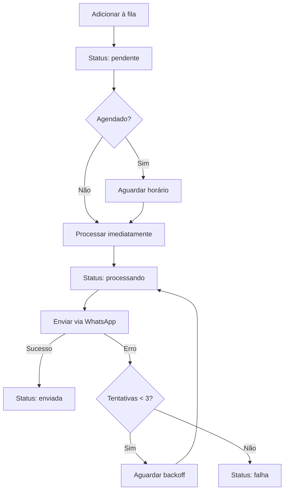

# 🔄 Módulo de Fila

Sistema de processamento assíncrono de mensagens com retry e priorização.

---

## 📋 Funcionalidades

### ✅ Gestão de Fila
- Adicionar mensagens à fila
- Processar mensagens assíncronas
- Retry automático (3 tentativas)
- Priorização de mensagens
- Limpeza de mensagens antigas
- Estatísticas de processamento

### 📊 Monitoramento
- Status de cada mensagem
- Taxa de sucesso/falha
- Tempo médio de processamento
- Alertas de mensagens travadas

---

## 🎯 Endpoints Principais

### POST `/fila/adicionar`
Adicionar mensagem à fila

```typescript
POST /fila/adicionar
Authorization: Bearer <token>
{
  "destinatario": "+5511999999999",
  "mensagem": "Olá! Seu agendamento está confirmado.",
  "prioridade": "alta",
  "agendadoPara": "2025-11-25T14:00:00Z"
}
```

### GET `/fila/status`
Status da fila

```typescript
GET /fila/status
Authorization: Bearer <token>

Response:
{
  "pendentes": 15,
  "processando": 3,
  "enviadas": 120,
  "falhas": 2,
  "taxaSucesso": 98.4
}
```

### POST `/fila/processar`
Processar fila manualmente (admin)

```typescript
POST /fila/processar
Authorization: Bearer <admin_token>

Response:
{
  "processadas": 18,
  "sucesso": 16,
  "falhas": 2
}
```

---

## 🏗️ Arquitetura

```
fila/
├── entities/
│   └── fila-mensagem.entity.ts  # Entidade da fila
├── dto/
│   └── adicionar-fila.dto.ts    # DTO adicionar
├── fila.controller.ts           # Endpoints REST
├── fila.service.ts              # Lógica de negócio
└── fila.module.ts               # Módulo NestJS
```

---

## 💾 Entidade FilaMensagem

```typescript
{
  id: string;
  clinicId: string;
  destinatario: string;          // Telefone
  mensagem: string;              // Texto processado
  status: 'pendente' | 'processando' | 'enviada' | 'falha';
  prioridade: 'baixa' | 'media' | 'alta' | 'urgente';
  tentativas: number;            // 0-3
  ultimaTentativa?: Date;
  erro?: string;                 // Mensagem de erro
  agendadoPara?: Date;           // Agendamento
  enviadoEm?: Date;
  createdAt: Date;
  updatedAt: Date;
}
```

---

## ⚡ Sistema de Prioridades

### Níveis de Prioridade

| Prioridade | Tempo Máximo | Uso |
|------------|--------------|-----|
| **urgente** | Imediato | Alertas críticos |
| **alta** | 5 min | Confirmações |
| **media** | 1h | Lembretes |
| **baixa** | 24h | Campanhas |

### Ordem de Processamento
1. Urgente → Alta → Média → Baixa
2. Dentro da mesma prioridade: FIFO (First In First Out)

---

## 🔄 Fluxo de Processamento



---

## 🔁 Sistema de Retry

### Configuração
- **Tentativas Máximas:** 3
- **Backoff:** Exponencial
  - 1ª tentativa: imediata
  - 2ª tentativa: após 2 minutos
  - 3ª tentativa: após 10 minutos

### Lógica de Retry
```typescript
const backoffMinutes = Math.pow(2, tentativas) * 2; // 2, 4, 8 minutos
const proximaTentativa = new Date(Date.now() + backoffMinutes * 60000);
```

---

## 📊 Logs Estruturados

### Sucesso
```json
{
  "message": "✅ Mensagem processada com sucesso",
  "context": {
    "filaId": "fila123",
    "destinatario": "+5511999999999",
    "tentativa": 1,
    "clinicId": "elevare-01"
  }
}
```

### Retry
```json
{
  "message": "⚠️ Tentativa falhou, agendando retry",
  "context": {
    "filaId": "fila123",
    "tentativa": 2,
    "maxTentativas": 3,
    "proximaTentativa": "2025-11-22T02:00:00Z"
  }
}
```

### Falha Definitiva
```json
{
  "message": "❌ Mensagem falhou após 3 tentativas",
  "context": {
    "filaId": "fila123",
    "erro": "WhatsApp number not found"
  }
}
```

---

## ⏰ Processamento Agendado

### Cron Job (NestJS Schedule)

```typescript
@Cron('*/5 * * * *') // A cada 5 minutos
async processarFila() {
  const mensagensPendentes = await this.buscarPendentes();
  
  for (const msg of mensagensPendentes) {
    await this.processar(msg.id);
  }
}
```

### Agendamento Customizado
```typescript
POST /fila/adicionar
{
  "destinatario": "+5511999999999",
  "mensagem": "Lembrete: consulta amanhã!",
  "agendadoPara": "2025-11-24T09:00:00Z"
}
```

---

## 🔗 Integração com Outros Módulos

- **WhatsApp:** Envia mensagens via provider
- **Mensagens:** Recebe mensagens processadas
- **Agendamentos:** Envia lembretes automáticos
- **Campanhas:** Processa mensagens em massa
- **Eventos:** Registra tentativas de envio

---

## 🛠️ Configuração

### Variáveis de Ambiente
```env
# Processamento
FILA_MAX_TENTATIVAS=3
FILA_BACKOFF_MINUTOS=2
FILA_PROCESSAR_INTERVALO=5  # minutos

# Limpeza
FILA_DIAS_MANTER_ENVIADAS=30
FILA_DIAS_MANTER_FALHAS=90
```

---

## 🧪 Testes

```bash
# Rodar testes unitários
npm run test -- fila

# Rodar testes E2E
npm run test:e2e -- fila.e2e-spec.ts
```

---

## 📈 Estatísticas

### Métricas Disponíveis

```typescript
GET /fila/estatisticas

Response:
{
  "hoje": {
    "total": 150,
    "sucesso": 145,
    "falhas": 5,
    "taxaSucesso": 96.7
  },
  "semana": {
    "total": 1200,
    "sucesso": 1180,
    "falhas": 20,
    "taxaSucesso": 98.3
  },
  "tempoMedioProcessamento": "2.5s"
}
```

---

## 🚨 Alertas e Monitoramento

### Condições de Alerta

| Condição | Ação |
|----------|------|
| Taxa de falha > 10% | Email para admin |
| Mensagem travada > 1h | Reprocessar |
| Fila > 1000 mensagens | Escalar workers |
| Tentativas esgotadas | Notificar suporte |

---

## 🔧 Como Usar

### 1. Adicionar Mensagem Simples
```bash
curl -X POST http://localhost:3000/api/fila/adicionar \
  -H "Authorization: Bearer <token>" \
  -H "Content-Type: application/json" \
  -d '{
    "destinatario": "+5511999999999",
    "mensagem": "Olá! Teste de mensagem."
  }'
```

### 2. Adicionar com Prioridade Alta
```bash
curl -X POST http://localhost:3000/api/fila/adicionar \
  -H "Authorization: Bearer <token>" \
  -H "Content-Type: application/json" \
  -d '{
    "destinatario": "+5511999999999",
    "mensagem": "URGENTE: Confirmação necessária!",
    "prioridade": "alta"
  }'
```

### 3. Agendar Mensagem
```bash
curl -X POST http://localhost:3000/api/fila/adicionar \
  -H "Authorization: Bearer <token>" \
  -H "Content-Type: application/json" \
  -d '{
    "destinatario": "+5511999999999",
    "mensagem": "Lembrete agendado!",
    "agendadoPara": "2025-11-25T09:00:00Z"
  }'
```

---

## 🧹 Limpeza Automática

### Cron de Limpeza

```typescript
@Cron('0 3 * * *') // Todo dia às 3h da manhã
async limparMensagensAntigas() {
  // Remover enviadas com sucesso > 30 dias
  await this.removerEnviadas(30);
  
  // Remover falhas > 90 dias
  await this.removerFalhas(90);
}
```

---

## 📝 Próximos Passos

- [ ] Redis para fila distribuída (Bull/BullMQ)
- [ ] Dashboard de monitoramento em tempo real
- [ ] Webhooks de status para sistemas externos
- [ ] Rate limiting por destinatário
- [ ] Detecção de números inválidos
- [ ] Retry inteligente (evitar horários noturnos)

---

## 🐛 Troubleshooting

### Problema: "Mensagem travada em 'processando'"
**Causa:** Worker crashou durante processamento  
**Solução:** Reprocessar manualmente via `/fila/reprocessar/:id`

### Problema: "Taxa de falha alta"
**Causa:** Problema na API do WhatsApp  
**Solução:** Verificar credenciais, status da API Meta

### Problema: "Fila crescendo infinitamente"
**Causa:** Processamento mais lento que entrada  
**Solução:** Aumentar workers, otimizar envios

---

## 📚 Documentação Adicional

- [Swagger API](/api#/fila)
- [NestJS Schedule Docs](https://docs.nestjs.com/techniques/task-scheduling)
- [Bull Queue Docs](https://github.com/OptimalBits/bull)
