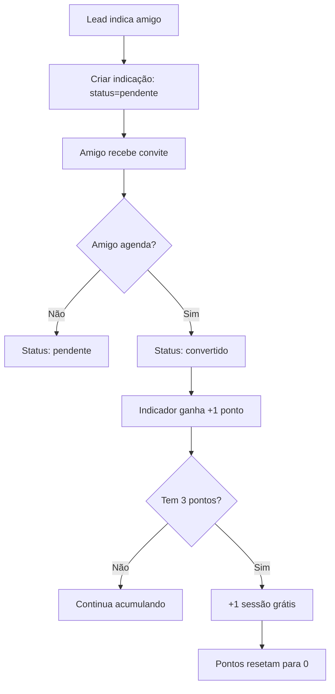

# 🎮 Módulo de Indicações

Sistema de gamificação com pontos e recompensas para incentivar indicações.

---

## 📋 Funcionalidades

### ✅ Sistema de Pontos
- **1 ponto** por indicação registrada
- **1 sessão grátis** a cada 3 pontos acumulados
- Rastreamento de indicador e indicado
- Validação de CPF/Telefone (evitar duplicatas)
- Histórico completo de indicações

### 🎁 Recompensas
- Sessões gratuitas
- Descontos progressivos
- Ranking de indicadores
- Badges de conquista

---

## 🎯 Endpoints Principais

### POST `/indicacoes`
Criar nova indicação

```typescript
POST /indicacoes
Authorization: Bearer <token>
{
  "indicadorId": "lead123",
  "nomeIndicado": "João Silva",
  "telefoneIndicado": "+5511988888888",
  "cpfIndicado": "123.456.789-00",
  "clinicId": "elevare-01"
}

Response:
{
  "indicacao": {
    "id": "ind456",
    "indicadorId": "lead123",
    "nomeIndicado": "João Silva",
    "status": "pendente",
    "pontosGanhos": 0
  },
  "recompensa": {
    "pontosAcumulados": 2,
    "sessoesGratisDisponiveis": 0,
    "proximaRecompensa": "1 ponto faltando para sessão grátis"
  }
}
```

### POST `/indicacoes/:id/confirmar`
Confirmar conversão da indicação (admin)

```typescript
POST /indicacoes/ind456/confirmar
Authorization: Bearer <admin_token>

Response:
{
  "indicacao": {
    "status": "convertido",
    "pontosGanhos": 1
  },
  "recompensa": {
    "pontosAcumulados": 3,
    "sessoesGratisDisponiveis": 1,  // 🎉 Ganhou sessão!
    "proximaRecompensa": "0 pontos para próxima sessão"
  }
}
```

### POST `/indicacoes/resgatar-sessao`
Resgatar sessão gratuita

```typescript
POST /indicacoes/resgatar-sessao
Authorization: Bearer <token>
{
  "leadId": "lead123"
}

Response:
{
  "sessoesRestantes": 0,
  "pontosRestantes": 0,
  "voucher": "SESS-GRATIS-123456"
}
```

### GET `/indicacoes/status/:leadId`
Status de indicações e recompensas

```typescript
GET /indicacoes/status/lead123
Authorization: Bearer <token>

Response:
{
  "indicacoesFeitas": 5,
  "indicacoesConvertidas": 3,
  "pontosAcumulados": 3,
  "sessoesGratisDisponiveis": 1,
  "proximaRecompensa": "0 pontos faltando",
  "ranking": 15
}
```

---

## 🏗️ Arquitetura

```
indicacoes/
├── entities/
│   ├── indicacao.entity.ts      # Indicação
│   └── recompensa.entity.ts     # Recompensa
├── dto/
│   ├── criar-indicacao.dto.ts   # DTO criação
│   └── resgatar-sessao.dto.ts   # DTO resgate
├── indicacoes.controller.ts     # Endpoints REST
├── indicacoes.service.ts        # Lógica de negócio
└── indicacoes.module.ts         # Módulo NestJS
```

---

## 💾 Entidades

### Indicacao

```typescript
{
  id: string;
  clinicId: string;
  indicadorId: string;           // Quem indicou
  nomeIndicado: string;
  telefoneIndicado: string;
  cpfIndicado?: string;
  emailIndicado?: string;
  status: 'pendente' | 'convertido' | 'cancelado';
  pontosGanhos: number;          // 0 ou 1
  dataConversao?: Date;
  observacoes?: string;
  createdAt: Date;
  updatedAt: Date;
}
```

### Recompensa

```typescript
{
  id: string;
  clinicId: string;
  leadId: string;                // Dono das recompensas
  pontosAcumulados: number;      // Total de pontos
  sessoesGratisDisponiveis: number;
  totalIndicacoesFeitas: number;
  totalIndicacoesConvertidas: number;
  ranking?: number;
  badges: string[];              // ['primeiro_indicador', 'mestre_indicacoes']
  createdAt: Date;
  updatedAt: Date;
}
```

---

## 🎮 Regras de Gamificação

### Sistema de Pontos

| Ação | Pontos |
|------|--------|
| Fazer indicação | 0 (pendente) |
| Indicação converte | +1 ponto |
| Indicado agenda primeira sessão | +1 ponto |
| Indicado comparece | +1 ponto |

### Sistema de Recompensas

| Pontos | Recompensa |
|--------|------------|
| 3 pontos | 1 sessão grátis |
| 6 pontos | 1 sessão grátis + 10% desconto permanente |
| 10 pontos | 1 sessão grátis + Badge "Mestre Indicações" |
| 20 pontos | 2 sessões grátis + 20% desconto permanente |

### Badges

| Badge | Requisito |
|-------|-----------|
| 🥉 **Primeiro Indicador** | 1ª indicação convertida |
| 🥈 **Indicador Ativo** | 5 indicações convertidas |
| 🥇 **Mestre Indicações** | 10 indicações convertidas |
| 👑 **Lenda** | 20 indicações convertidas |

---

## 🔄 Fluxo de Indicação



---

## 📊 Logs Estruturados

```json
{
  "message": "🎉 Indicação convertida - pontos atualizados",
  "context": {
    "indicacaoId": "ind456",
    "indicadorId": "lead123",
    "pontosAcumulados": 3,
    "sessoesGanhas": 1,
    "clinicId": "elevare-01"
  }
}
```

---

## 🔗 Integração com Outros Módulos

- **Leads:** Valida indicador e cria indicado como novo lead
- **Agendamentos:** Detecta primeira sessão do indicado
- **Mensagens:** Envia notificações de recompensa
- **Eventos:** Registra conversões e resgates
- **WhatsApp:** Envia convites para indicados

---

## 🛠️ Configuração

### Variáveis de Ambiente
```env
# Sistema de Pontos
PONTOS_POR_INDICACAO=1
PONTOS_PARA_SESSAO_GRATIS=3
MAX_SESSOES_ACUMULADAS=5

# Validações
VALIDAR_CPF=true
VALIDAR_TELEFONE_DUPLICADO=true
```

---

## 🧪 Testes

### Testes Unitários
```bash
npm run test -- indicacoes.service.spec.ts
```

### Cenários Cobertos
- ✅ Registrar indicação (0 pontos iniciais)
- ✅ Confirmar conversão (+1 ponto)
- ✅ Atingir 3 pontos (ganha sessão)
- ✅ Resgatar sessão (decrementa contador)
- ✅ Validar duplicatas (CPF/telefone)

---

## 🔧 Como Usar

### 1. Fazer Indicação
```bash
curl -X POST http://localhost:3000/api/indicacoes \
  -H "Authorization: Bearer <token>" \
  -H "Content-Type: application/json" \
  -d '{
    "indicadorId": "lead123",
    "nomeIndicado": "João Silva",
    "telefoneIndicado": "+5511988888888",
    "cpfIndicado": "123.456.789-00"
  }'
```

### 2. Confirmar Conversão (Admin)
```bash
curl -X POST http://localhost:3000/api/indicacoes/ind456/confirmar \
  -H "Authorization: Bearer <admin_token>"
```

### 3. Resgatar Sessão Grátis
```bash
curl -X POST http://localhost:3000/api/indicacoes/resgatar-sessao \
  -H "Authorization: Bearer <token>" \
  -H "Content-Type: application/json" \
  -d '{ "leadId": "lead123" }'
```

### 4. Ver Status
```bash
curl http://localhost:3000/api/indicacoes/status/lead123 \
  -H "Authorization: Bearer <token>"
```

---

## 📈 Ranking de Indicadores

### Calcular Ranking
```typescript
GET /indicacoes/ranking?limit=10

Response:
[
  {
    "posicao": 1,
    "leadId": "lead789",
    "nome": "Maria Silva",
    "indicacoesConvertidas": 15,
    "pontosAcumulados": 15,
    "badges": ["👑 Lenda"]
  },
  ...
]
```

---

## 🎁 Exemplos de Mensagens

### Convite para Indicado
```
Olá {{nome_indicado}}! 👋

Você foi indicado por {{nome_indicador}} para conhecer a {{clinica}}!

Como presente de boas-vindas, você tem:
🎁 10% de desconto na primeira sessão

Agende agora: {{link_agendamento}}
```

### Notificação de Recompensa
```
Parabéns {{nome_indicador}}! 🎉

Sua indicação {{nome_indicado}} agendou a primeira sessão!

Você ganhou:
⭐ +1 ponto (total: {{pontos}})
🎁 Faltam {{pontos_faltando}} pontos para ganhar 1 sessão grátis!
```

### Sessão Grátis Liberada
```
PARABÉNS {{nome}}! 🏆

Você atingiu 3 pontos e ganhou:
🎁 1 SESSÃO GRÁTIS!

Use o voucher: {{voucher}}
Válido por 90 dias.

Continue indicando e ganhe mais recompensas! 💪
```

---

## 📝 Próximos Passos

- [ ] Sistema de vouchers com QR Code
- [ ] Integração com programa de fidelidade
- [ ] Compartilhamento via redes sociais
- [ ] Campeonato mensal de indicações
- [ ] Recompensas personalizadas por clínica
- [ ] Dashboard de gamificação

---

## 🐛 Troubleshooting

### Problema: "CPF já cadastrado"
**Causa:** Indicado já existe no sistema  
**Solução:** Verificar se já é cliente, não pode ser indicado novamente

### Problema: "Nenhuma sessão disponível para resgate"
**Causa:** Lead não tem sessões grátis  
**Solução:** Fazer mais indicações para acumular pontos

### Problema: "Pontos não atualizaram"
**Causa:** Indicação ainda em status 'pendente'  
**Solução:** Admin precisa confirmar conversão

---

## 📚 Documentação Adicional

- [Swagger API](/api#/indicacoes)
- [Guia de Gamificação](./docs/gamificacao.md)
- [Regras de Pontos](./docs/pontos.md)
