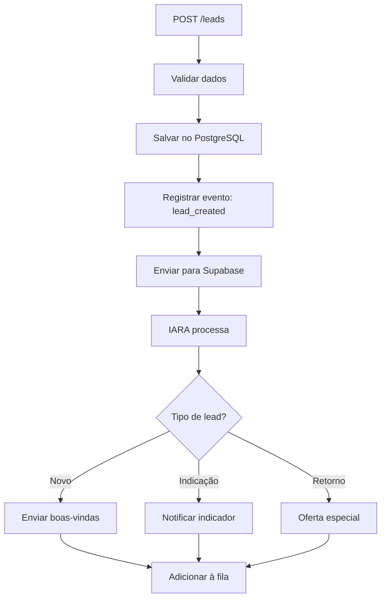

# 🎯 Módulo de Leads

Sistema central de gestão de leads com integração Supabase e IARA.

---

## 📋 Funcionalidades

### ✅ Gestão de Leads
- Criar novos leads (manual ou via integração)
- Atualizar dados de leads
- Buscar e filtrar leads
- Segmentação por status, origem, tags
- Importação em lote (CSV)
- Export de relatórios

### 🔗 Integrações
- **Supabase:** Envia leads para processamento
- **IARA:** Sistema inteligente processa leads
- **RD Station:** Sincronização de dados
- **WhatsApp:** Notificações automáticas

---

## 🎯 Endpoints Principais

### POST `/leads`
Criar novo lead (3 etapas automáticas)

```typescript
POST /leads
Authorization: Bearer <token>
{
  "nome": "Maria Silva",
  "telefone": "+5511999999999",
  "email": "maria@email.com",
  "origem": "google",
  "clinicId": "elevare-01",
  "observacoes": "Interesse em terapia online"
}

Response:
{
  "lead": {
    "id": "lead123",
    "nome": "Maria Silva",
    "status": "novo",
    "createdAt": "2025-11-22T10:00:00Z"
  },
  "supabase": {
    "sincronizado": true,
    "id": "sup_456"
  },
  "iara": {
    "processado": true,
    "proximaAcao": "enviar_boas_vindas"
  }
}
```

**Fluxo Automático:**
1. ✅ Validar dados (telefone, email)
2. ✅ Salvar no PostgreSQL
3. ✅ Enviar para Supabase (processamento)
4. ✅ IARA processa e define próxima ação

---

### GET `/leads`
Listar leads com filtros

```typescript
GET /leads?status=novo&origem=google&limit=50
Authorization: Bearer <token>

Response:
{
  "total": 120,
  "page": 1,
  "limit": 50,
  "data": [
    {
      "id": "lead123",
      "nome": "Maria Silva",
      "telefone": "+5511999999999",
      "email": "maria@email.com",
      "status": "novo",
      "origem": "google",
      "tags": ["ppc", "terapia-online"],
      "createdAt": "2025-11-22T10:00:00Z"
    }
  ]
}
```

### GET `/leads/:id`
Buscar lead específico

```typescript
GET /leads/lead123
Authorization: Bearer <token>

Response:
{
  "id": "lead123",
  "nome": "Maria Silva",
  "telefone": "+5511999999999",
  "email": "maria@email.com",
  "status": "ativo",
  "origem": "google",
  "tags": ["ppc", "terapia-online"],
  "primeiroContato": "2025-11-22T10:00:00Z",
  "ultimoContato": "2025-11-23T15:30:00Z",
  "totalAgendamentos": 3,
  "totalIndicacoes": 1,
  "observacoes": "Interesse em terapia online",
  "createdAt": "2025-11-22T10:00:00Z",
  "updatedAt": "2025-11-23T15:30:00Z"
}
```

### PUT `/leads/:id`
Atualizar lead

```typescript
PUT /leads/lead123
Authorization: Bearer <token>
{
  "status": "ativo",
  "email": "novo@email.com",
  "tags": ["ppc", "terapia-online", "convertido"]
}
```

---

## 🏗️ Arquitetura

```
leads/
├── entities/
│   └── lead.entity.ts           # Entidade principal
├── dto/
│   ├── criar-lead.dto.ts        # DTO criação
│   ├── atualizar-lead.dto.ts    # DTO atualização
│   └── filtrar-leads.dto.ts     # DTO filtros
├── leads.controller.ts          # Endpoints REST
├── leads.service.ts             # Lógica de negócio
└── leads.module.ts              # Módulo NestJS
```

---

## 💾 Entidade Lead

```typescript
{
  id: string;
  clinicId: string;
  nome: string;
  telefone: string;
  email?: string;
  cpf?: string;
  dataNascimento?: Date;
  
  status: 'novo' | 'ativo' | 'inativo' | 'convertido' | 'perdido';
  origem: 'google' | 'instagram' | 'facebook' | 'indicacao' | 'whatsapp' | 'outro';
  tags: string[];                // ['ppc', 'terapia-online']
  
  primeiroContato?: Date;
  ultimoContato?: Date;
  observacoes?: string;
  
  // Relacionamentos
  agendamentos?: Agendamento[];
  indicacoes?: Indicacao[];
  eventos?: Event[];
  
  createdAt: Date;
  updatedAt: Date;
}
```

---

## 📊 Status de Lead

| Status | Descrição | Quando |
|--------|-----------|--------|
| **novo** | Recém cadastrado | Lead criado |
| **ativo** | Engajado | Respondeu mensagem ou agendou |
| **inativo** | Sem contato > 30 dias | Automático via cron |
| **convertido** | Cliente pagante | Primeira sessão confirmada |
| **perdido** | Não converteu | Desistiu ou não responde |

---

## 🎯 Origens de Lead

| Origem | Descrição |
|--------|-----------|
| `google` | Google Ads, SEO |
| `instagram` | Instagram Ads, Stories |
| `facebook` | Facebook Ads, Messenger |
| `indicacao` | Indicado por cliente |
| `whatsapp` | Contato direto |
| `outro` | Outras fontes |

---

## 🔄 Fluxo de Criação (Integrado)



---

## 🔗 Integração Supabase

### Envio Automático
```typescript
// Ao criar lead
const lead = await this.leadsRepository.save(data);

// Enviar para Supabase
await this.supabaseService.sincronizarLead({
  id: lead.id,
  nome: lead.nome,
  telefone: lead.telefone,
  email: lead.email,
  clinicId: lead.clinicId
});
```

### Resposta da IARA
```json
{
  "status": "processado",
  "proximaAcao": "enviar_boas_vindas",
  "templateId": "tpl_welcome",
  "agendadoPara": "2025-11-22T10:30:00Z"
}
```

---

## 🏷️ Sistema de Tags

### Tags Automáticas
- `novo` - Lead recém criado
- `retorno` - Lead retornando após inatividade
- `vip` - Múltiplas indicações ou alto engajamento
- `risco` - Sem resposta por 7+ dias

### Tags Customizadas
```typescript
PUT /leads/lead123
{
  "tags": ["ppc", "terapia-online", "desconto-aplicado"]
}
```

---

## 📊 Logs Estruturados

```json
{
  "message": "✅ Lead criado e sincronizado",
  "context": {
    "leadId": "lead123",
    "nome": "Maria Silva",
    "origem": "google",
    "supabaseSincronizado": true,
    "iaraProcessado": true,
    "clinicId": "elevare-01"
  }
}
```

---

## 🔗 Integração com Outros Módulos

- **Agendamentos:** Vincular lead a agendamentos
- **Indicações:** Criar lead de indicado
- **Mensagens:** Enviar comunicações personalizadas
- **Eventos:** Rastrear todas as interações
- **Fila:** Processar mensagens de boas-vindas

---

## 🛠️ Configuração

### Variáveis de Ambiente
```env
# Supabase
SUPABASE_URL=https://xxxxx.supabase.co
SUPABASE_KEY=eyJhbGc...
SUPABASE_SERVICE_KEY=eyJhbGc...

# IARA
IARA_API_URL=https://iara.elevare.com/api
IARA_API_KEY=iara_xxx

# Validações
VALIDAR_TELEFONE=true
VALIDAR_EMAIL=true
VALIDAR_CPF_DUPLICADO=true
```

---

## 🧪 Testes

```bash
# Rodar testes unitários
npm run test -- leads

# Rodar testes E2E
npm run test:e2e -- leads.e2e-spec.ts
```

---

## 🔧 Como Usar

### 1. Criar Lead Simples
```bash
curl -X POST http://localhost:3000/api/leads \
  -H "Authorization: Bearer <token>" \
  -H "Content-Type: application/json" \
  -d '{
    "nome": "João Silva",
    "telefone": "+5511988888888",
    "origem": "instagram"
  }'
```

### 2. Criar Lead Completo
```bash
curl -X POST http://localhost:3000/api/leads \
  -H "Authorization: Bearer <token>" \
  -H "Content-Type: application/json" \
  -d '{
    "nome": "Maria Santos",
    "telefone": "+5511977777777",
    "email": "maria@email.com",
    "cpf": "123.456.789-00",
    "origem": "google",
    "tags": ["ppc", "terapia-casal"],
    "observacoes": "Interesse em sessões online"
  }'
```

### 3. Buscar Leads
```bash
curl "http://localhost:3000/api/leads?status=novo&origem=google" \
  -H "Authorization: Bearer <token>"
```

### 4. Atualizar Status
```bash
curl -X PUT http://localhost:3000/api/leads/lead123 \
  -H "Authorization: Bearer <token>" \
  -H "Content-Type: application/json" \
  -d '{ "status": "ativo" }'
```

---

## 📈 Importação em Lote

### CSV Format
```csv
nome,telefone,email,origem,tags
Maria Silva,+5511999999999,maria@email.com,google,"ppc,terapia-online"
João Santos,+5511988888888,joao@email.com,instagram,"stories,terapia-individual"
```

### Endpoint
```typescript
POST /leads/importar
Content-Type: multipart/form-data
Authorization: Bearer <token>

{
  "file": <arquivo.csv>,
  "clinicId": "elevare-01"
}

Response:
{
  "total": 150,
  "sucesso": 145,
  "falhas": 5,
  "erros": [
    { "linha": 23, "erro": "Telefone inválido" }
  ]
}
```

---

## 📊 Relatórios

### Estatísticas de Leads
```typescript
GET /leads/estatisticas?periodo=30d

Response:
{
  "total": 500,
  "porStatus": {
    "novo": 120,
    "ativo": 250,
    "convertido": 100,
    "inativo": 20,
    "perdido": 10
  },
  "porOrigem": {
    "google": 200,
    "instagram": 150,
    "indicacao": 100,
    "facebook": 50
  },
  "taxaConversao": 20.0  // 100/500
}
```

---

## 📝 Próximos Passos

- [ ] Lead scoring (pontuação de qualidade)
- [ ] Detecção automática de duplicatas
- [ ] Enriquecimento de dados (APIs externas)
- [ ] Previsão de conversão (ML)
- [ ] Segmentação avançada (RFM)
- [ ] Integração com CRM externo

---

## 🐛 Troubleshooting

### Problema: "Telefone inválido"
**Causa:** Formato incorreto (deve ser +55...)  
**Solução:** Usar formato E.164: `+5511999999999`

### Problema: "Lead não sincronizado com Supabase"
**Causa:** Credenciais Supabase incorretas  
**Solução:** Verificar variáveis `SUPABASE_URL` e `SUPABASE_KEY`

### Problema: "IARA não processou"
**Causa:** API IARA offline ou credenciais inválidas  
**Solução:** Verificar `IARA_API_URL` e `IARA_API_KEY`

---

## 📚 Documentação Adicional

- [Swagger API](/api#/leads)
- [Guia de Integração Supabase](./docs/supabase.md)
- [Documentação IARA](./docs/iara.md)
- [Schema de Lead](./docs/schema.md)
