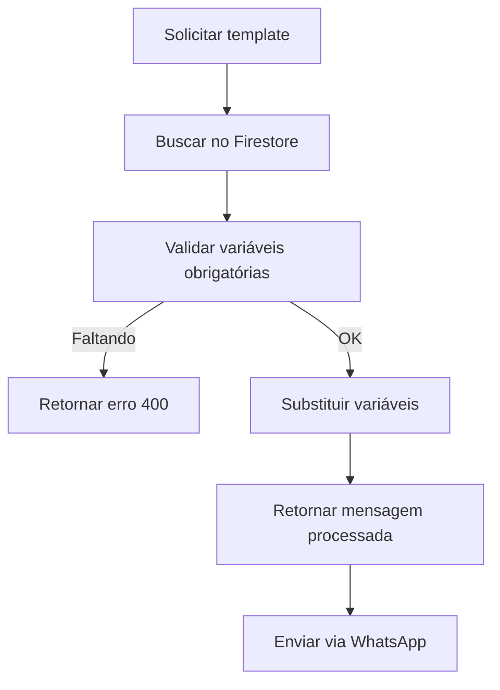

# 💬 Módulo de Mensagens

Sistema de templates de mensagens com variáveis dinâmicas e integração Firebase.

---

## 📋 Funcionalidades

### ✅ Templates
- Criar templates reutilizáveis
- Variáveis dinâmicas: `{{nome}}`, `{{data}}`, etc.
- Versionamento de templates
- Templates por categoria (confirmação, lembrete, cobrança)
- Armazenamento no Firestore

### 🔄 Processamento
- Substituição automática de variáveis
- Validação de variáveis obrigatórias
- Preview de mensagem antes do envio
- Histórico de mensagens enviadas

---

## 🎯 Endpoints Principais

### GET `/mensagens/templates/:categoria`
Listar templates de uma categoria

```typescript
GET /mensagens/templates/confirmacao
Authorization: Bearer <token>

Response:
[
  {
    "id": "tpl_001",
    "nome": "Confirmação Simples",
    "categoria": "confirmacao",
    "texto": "Olá {{nome}}! Seu agendamento para {{data}} às {{hora}} está confirmado.",
    "variaveis": ["nome", "data", "hora"]
  }
]
```

### POST `/mensagens/processar`
Processar template com variáveis

```typescript
POST /mensagens/processar
{
  "templateId": "tpl_001",
  "variaveis": {
    "nome": "Maria Silva",
    "data": "25/11/2025",
    "hora": "14:00"
  }
}

Response:
{
  "mensagem": "Olá Maria Silva! Seu agendamento para 25/11/2025 às 14:00 está confirmado."
}
```

### POST `/mensagens/templates`
Criar novo template (admin)

```typescript
POST /mensagens/templates
Authorization: Bearer <admin_token>
{
  "nome": "Lembrete 24h",
  "categoria": "lembrete",
  "texto": "{{nome}}, lembramos que sua sessão é amanhã às {{hora}}!",
  "variaveis": ["nome", "hora"]
}
```

---

## 🏗️ Arquitetura

```
mensagens/
├── entities/
│   └── mensagem-template.entity.ts  # Template no PostgreSQL
├── dto/
│   ├── criar-template.dto.ts        # DTO criação
│   └── processar-template.dto.ts    # DTO processamento
├── mensagens.controller.ts          # Endpoints REST
├── mensagens.service.ts             # Lógica de negócio
└── mensagens.module.ts              # Módulo NestJS
```

---

## 💾 Entidade MensagemTemplate

```typescript
{
  id: string;
  clinicId: string;
  nome: string;
  categoria: 'confirmacao' | 'lembrete' | 'cobranca' | 'indicacao' | 'personalizada';
  texto: string;                     // Com variáveis: {{var}}
  variaveis: string[];               // ['nome', 'data', 'hora']
  ativo: boolean;
  versao: number;
  createdAt: Date;
  updatedAt: Date;
}
```

---

## 🔤 Variáveis Disponíveis

### Variáveis Padrão

| Variável | Descrição | Exemplo |
|----------|-----------|---------|
| `{{nome}}` | Nome do paciente | Maria Silva |
| `{{data}}` | Data formatada | 25/11/2025 |
| `{{hora}}` | Hora formatada | 14:00 |
| `{{clinica}}` | Nome da clínica | Clínica Elevare |
| `{{telefone}}` | Telefone da clínica | (11) 99999-9999 |
| `{{endereco}}` | Endereço da clínica | Av. Paulista, 1000 |

### Variáveis Customizadas

Você pode criar suas próprias variáveis:

```typescript
{
  "texto": "Olá {{nome_paciente}}, sua sessão do tipo {{tipo_sessao}} está agendada.",
  "variaveis": ["nome_paciente", "tipo_sessao"]
}
```

---

## 🎨 Categorias de Templates

### 1. **Confirmação**
- Confirmação de agendamento
- Confirmação de cadastro
- Confirmação de pagamento

### 2. **Lembrete**
- Lembrete 24h antes
- Lembrete 1 semana antes
- Lembrete de retorno

### 3. **Cobrança**
- Cobrança de sessão
- Lembrete de boleto
- Confirmação de pagamento

### 4. **Indicação**
- Convite para indicar
- Recompensa de indicação
- Status de indicação

### 5. **Personalizada**
- Mensagens customizadas
- Campanhas especiais
- Mensagens sazonais

---

## 🔄 Fluxo de Processamento



---

## 🧪 Exemplos de Templates

### Confirmação de Agendamento
```
Olá {{nome}}! ✅

Seu agendamento está CONFIRMADO:
📅 Data: {{data}}
🕐 Horário: {{hora}}
📍 Local: {{clinica}}

Qualquer dúvida, entre em contato: {{telefone}}
```

### Lembrete 24h
```
{{nome}}, tudo bem? 😊

Lembramos que sua sessão é AMANHÃ:
🕐 Às {{hora}}
📍 {{endereco}}

Até lá!
```

### Cobrança de Sessão
```
Olá {{nome}}!

Segue o boleto da sua sessão do dia {{data}}:
💰 Valor: R$ {{valor}}
📅 Vencimento: {{vencimento}}

Link: {{link_boleto}}
```

---

## 📊 Logs Estruturados

```json
{
  "message": "✅ Template processado",
  "context": {
    "templateId": "tpl_001",
    "categoria": "confirmacao",
    "variaveis": ["nome", "data", "hora"],
    "clinicId": "elevare-01"
  }
}
```

---

## 🔗 Integração com Outros Módulos

- **WhatsApp:** Envia mensagens processadas
- **Fila:** Agenda envios em lote
- **Campanhas:** Usa templates para campanhas
- **Agendamentos:** Envia confirmações e lembretes

---

## 🛠️ Configuração

### Firestore Collections

```
mensagens-templates/
  ├── {clinicId}/
  │   ├── confirmacao/
  │   │   └── {templateId}
  │   ├── lembrete/
  │   └── cobranca/
```

### Variáveis de Ambiente
```env
# Firebase
FIREBASE_PROJECT_ID=elevare-iara
FIREBASE_PRIVATE_KEY="..."
FIREBASE_CLIENT_EMAIL=firebase-adminsdk@elevare-iara.iam.gserviceaccount.com
```

---

## 🔧 Como Usar

### 1. Criar Template
```bash
curl -X POST http://localhost:3000/api/mensagens/templates \
  -H "Authorization: Bearer <token>" \
  -H "Content-Type: application/json" \
  -d '{
    "nome": "Lembrete Personalizado",
    "categoria": "lembrete",
    "texto": "Oi {{nome}}, sua sessão é {{quando}}!",
    "variaveis": ["nome", "quando"]
  }'
```

### 2. Processar Template
```bash
curl -X POST http://localhost:3000/api/mensagens/processar \
  -H "Authorization: Bearer <token>" \
  -H "Content-Type: application/json" \
  -d '{
    "templateId": "tpl_001",
    "variaveis": {"nome": "João", "quando": "amanhã às 10h"}
  }'
```

### 3. Listar Templates
```bash
curl http://localhost:3000/api/mensagens/templates/confirmacao \
  -H "Authorization: Bearer <token>"
```

---

## 🧪 Testes

```bash
# Rodar testes unitários
npm run test -- mensagens

# Testar processamento de template
npm run test -- mensagens.service.spec.ts
```

---

## 📝 Próximos Passos

- [ ] Editor visual de templates
- [ ] Preview em tempo real
- [ ] Templates multilíngues
- [ ] Versionamento com rollback
- [ ] A/B testing de templates
- [ ] Analytics de conversão

---

## 🐛 Troubleshooting

### Problema: "Variável obrigatória faltando"
**Causa:** Template exige variável não fornecida  
**Solução:** Verificar `variaveis` no template e fornecer todas

### Problema: "Template não encontrado"
**Causa:** ID ou categoria inválidos  
**Solução:** Listar templates disponíveis antes de processar

---

## 📚 Documentação Adicional

- [Swagger API](/api#/mensagens)
- [Firestore Console](https://console.firebase.google.com)
- [Guia de Variáveis](./docs/variaveis.md)
