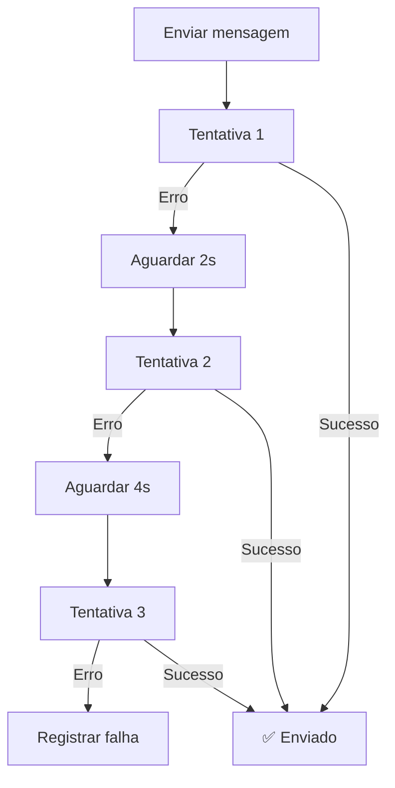

# 📱 Módulo WhatsApp

Integração completa com WhatsApp Business API (Meta) para envio de mensagens.

---

## 📋 Funcionalidades

### ✅ Envio de Mensagens
- Mensagens de texto simples
- Mensagens com mídia (imagem, vídeo, documento)
- Templates aprovados pela Meta
- Botões interativos
- Retry automático (3 tentativas)
- Backoff exponencial

### 🔗 Webhook
- Receber status de entrega
- Receber respostas de clientes
- Eventos de leitura
- Validação de assinatura Meta

---

## 🎯 Endpoints Principais

### POST `/whatsapp/webhook`
Webhook público para receber eventos do WhatsApp (Meta)

```typescript
POST /whatsapp/webhook
X-Hub-Signature-256: sha256=...
{
  "entry": [{
    "changes": [{
      "value": {
        "messages": [{
          "from": "5511999999999",
          "text": { "body": "Olá!" }
        }]
      }
    }]
  }]
}
```

### GET `/whatsapp/webhook`
Verificação do webhook (Meta)

```typescript
GET /whatsapp/webhook?hub.mode=subscribe&hub.verify_token=TOKEN&hub.challenge=CHALLENGE

Response: CHALLENGE
```

### POST `/whatsapp/send`
Enviar mensagem manualmente

```typescript
POST /whatsapp/send
Authorization: Bearer <token>
{
  "to": "+5511999999999",
  "message": "Olá! Seu agendamento foi confirmado."
}
```

---

## 🏗️ Arquitetura

```
whatsapp/
├── providers/
│   └── whatsapp.provider.ts     # Integração Meta API
├── dto/
│   └── send-message.dto.ts      # DTOs de envio
├── whatsapp.controller.ts       # Endpoints REST
├── whatsapp.service.ts          # Lógica de negócio
└── whatsapp.module.ts           # Módulo NestJS
```

---

## 📡 WhatsApp Provider

### Métodos Disponíveis

```typescript
interface WhatsAppProvider {
  sendTextMessage(to: string, message: string): Promise<any>;
  sendMediaMessage(to: string, mediaUrl: string, caption?: string): Promise<any>;
  sendTemplateMessage(to: string, templateName: string, variables: string[]): Promise<any>;
  isWhatsAppNumber(phoneNumber: string): Promise<boolean>;
}
```

---

## 🔄 Sistema de Retry

### Configuração
- **Tentativas:** 3
- **Backoff:** Exponencial
  - 1ª tentativa: imediata
  - 2ª tentativa: após 2s
  - 3ª tentativa: após 4s

### Fluxo


---

## 🔐 Webhook Security

### Validação de Assinatura

A Meta envia header `X-Hub-Signature-256` com HMAC SHA256:

```typescript
const signature = req.headers['x-hub-signature-256'];
const expectedSignature = crypto
  .createHmac('sha256', APP_SECRET)
  .update(JSON.stringify(req.body))
  .digest('hex');

if (signature !== `sha256=${expectedSignature}`) {
  throw new UnauthorizedException();
}
```

---

## 📊 Eventos do Webhook

### Status de Entrega

| Status | Descrição |
|--------|-----------|
| `sent` | Mensagem enviada para o servidor WhatsApp |
| `delivered` | Mensagem entregue no celular do destinatário |
| `read` | Mensagem lida pelo destinatário |
| `failed` | Falha no envio |

### Exemplo de Evento
```json
{
  "object": "whatsapp_business_account",
  "entry": [{
    "changes": [{
      "value": {
        "statuses": [{
          "id": "wamid.xxx",
          "status": "delivered",
          "timestamp": "1700000000"
        }]
      }
    }]
  }]
}
```

---

## 🎨 Templates

### Template Aprovado pela Meta

```typescript
POST /whatsapp/send-template
{
  "to": "+5511999999999",
  "templateName": "confirmacao_agendamento",
  "language": "pt_BR",
  "components": [{
    "type": "body",
    "parameters": [
      { "type": "text", "text": "Maria Silva" },
      { "type": "text", "text": "25/11/2025" },
      { "type": "text", "text": "14:00" }
    ]
  }]
}
```

### Criar Template no Meta Console
1. Acesse [Business Manager](https://business.facebook.com)
2. WhatsApp Manager → Message Templates
3. Criar novo template
4. Aguardar aprovação (24-48h)

---

## 🧪 Testes

### Testes Unitários
```bash
npm run test -- whatsapp.service.spec.ts
```

### Testes Cobertos
- ✅ Envio de texto simples
- ✅ Retry com 3 tentativas
- ✅ Backoff exponencial (2s, 4s)
- ✅ Validação de número WhatsApp
- ✅ Envio de mídia
- ✅ Envio de template

---

## 📊 Logs Estruturados

```json
{
  "message": "📤 Enviando mensagem WhatsApp",
  "context": {
    "to": "+5511999999999",
    "provider": "meta-api",
    "attempt": 1,
    "maxAttempts": 3
  }
}
```

---

## 🔗 Integração com Outros Módulos

- **Fila:** Processa envios em lote
- **Mensagens:** Usa templates processados
- **Agendamentos:** Envia confirmações
- **Campanhas:** Envia mensagens em massa
- **Eventos:** Registra entregas e leituras

---

## 🛠️ Configuração

### Variáveis de Ambiente

```env
# Meta WhatsApp Business API
WHATSAPP_API_URL=https://graph.facebook.com/v18.0
WHATSAPP_PHONE_NUMBER_ID=123456789012345
WHATSAPP_ACCESS_TOKEN=EAAxxxxxxxxxxxxx
WHATSAPP_APP_SECRET=xxxxxxxxxxxxxx
WHATSAPP_VERIFY_TOKEN=seu_token_secreto_para_webhook
```

### Como Obter Credenciais

1. **Business Manager:**
   - Acesse https://business.facebook.com
   - Crie um app no Meta Developers

2. **Phone Number ID:**
   - WhatsApp Manager → Phone Numbers
   - Copie o ID do número

3. **Access Token:**
   - App Dashboard → WhatsApp → API Setup
   - Gerar token permanente

4. **Webhook:**
   - App Dashboard → WhatsApp → Configuration
   - Callback URL: `https://seu-dominio.com/api/whatsapp/webhook`
   - Verify Token: o mesmo do `.env`

---

## 🚀 Como Configurar Webhook

### 1. Expor Endpoint Público
```bash
# Desenvolvimento (ngrok)
ngrok http 3000

# URL gerada: https://abc123.ngrok.io
```

### 2. Configurar no Meta
```
Callback URL: https://abc123.ngrok.io/api/whatsapp/webhook
Verify Token: seu_token_secreto_para_webhook
Subscribe to: messages, message_status
```

### 3. Testar
```bash
# Meta vai fazer GET para verificar
GET /whatsapp/webhook?hub.mode=subscribe&hub.verify_token=...

# Deve retornar o hub.challenge
```

---

## 📝 Limites da API

### Rate Limits (Meta)

| Tier | Mensagens/dia |
|------|---------------|
| Tier 1 | 1.000 |
| Tier 2 | 10.000 |
| Tier 3 | 100.000 |
| Unlimited | Sem limite |

### Boas Práticas
- ✅ Usar templates para mensagens recorrentes
- ✅ Respeitar opt-out de clientes
- ✅ Não enviar spam
- ✅ Responder dentro de 24h
- ✅ Manter qualidade alta (> 80%)

---

## 🐛 Troubleshooting

### Problema: "Number is not a WhatsApp number"
**Causa:** Número não tem WhatsApp ativo  
**Solução:** Validar com `isWhatsAppNumber()` antes de enviar

### Problema: "Message failed after 3 attempts"
**Causa:** Número inválido ou API offline  
**Solução:** Verificar logs, validar credenciais, testar número manualmente

### Problema: "Webhook signature validation failed"
**Causa:** APP_SECRET incorreto  
**Solução:** Verificar variável `WHATSAPP_APP_SECRET`

### Problema: "Template not found"
**Causa:** Template não aprovado ou nome incorreto  
**Solução:** Verificar status no Meta Business Manager

---

## 📚 Documentação Adicional

- [Meta WhatsApp Business API Docs](https://developers.facebook.com/docs/whatsapp)
- [Swagger API](/api#/whatsapp)
- [Template Guidelines](https://developers.facebook.com/docs/whatsapp/message-templates/guidelines)
- [Webhook Reference](https://developers.facebook.com/docs/whatsapp/cloud-api/webhooks)
